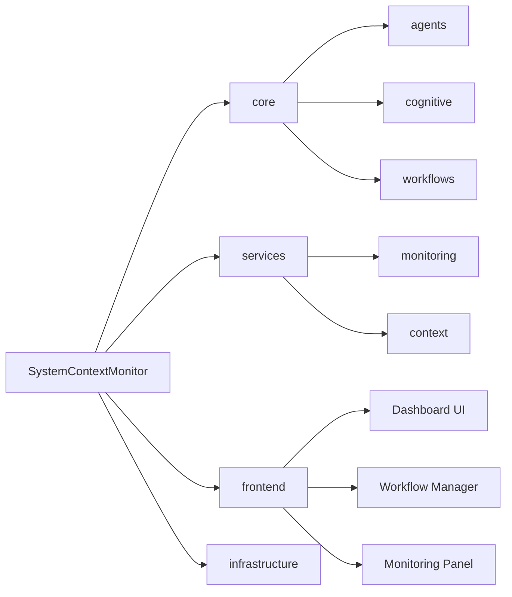
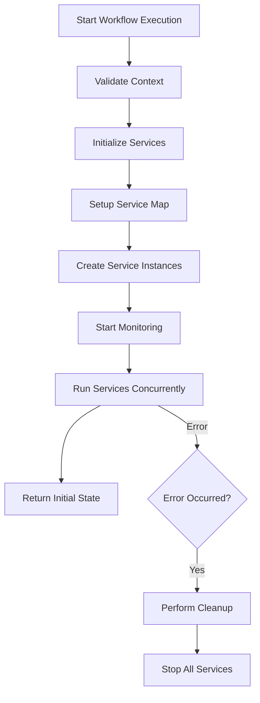
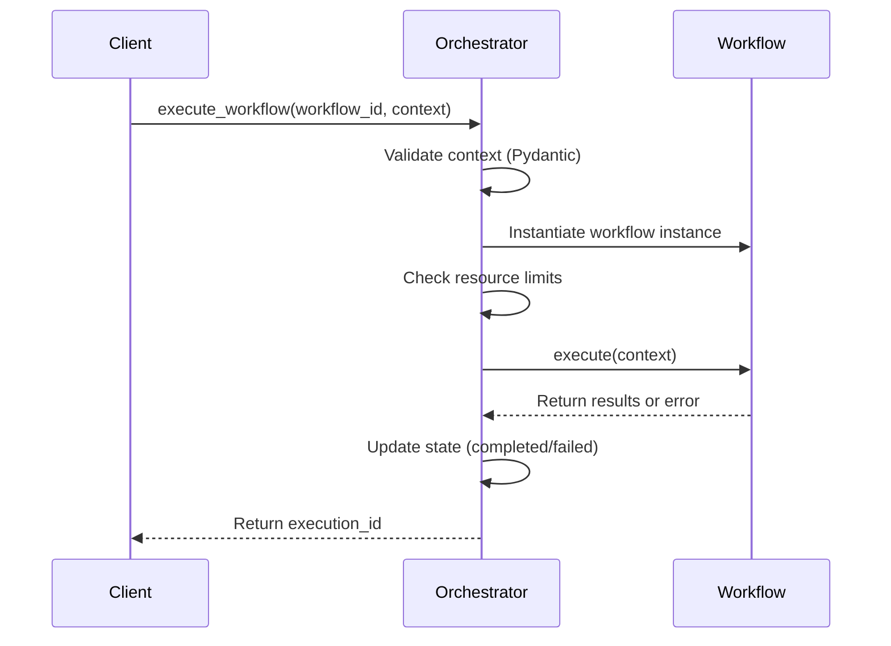
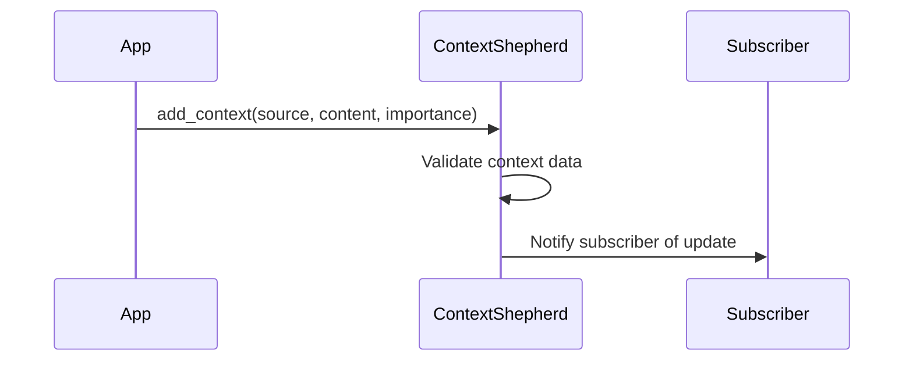
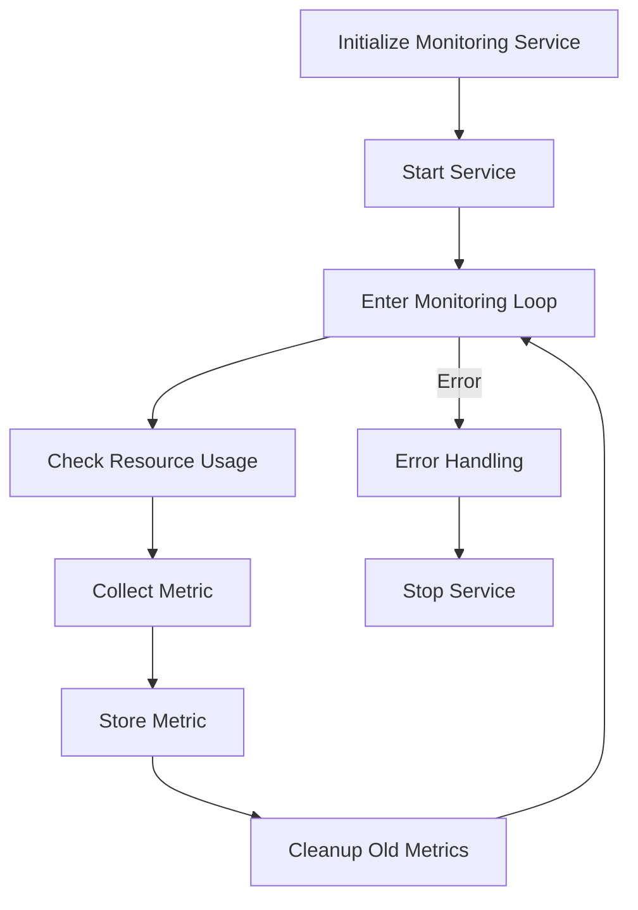
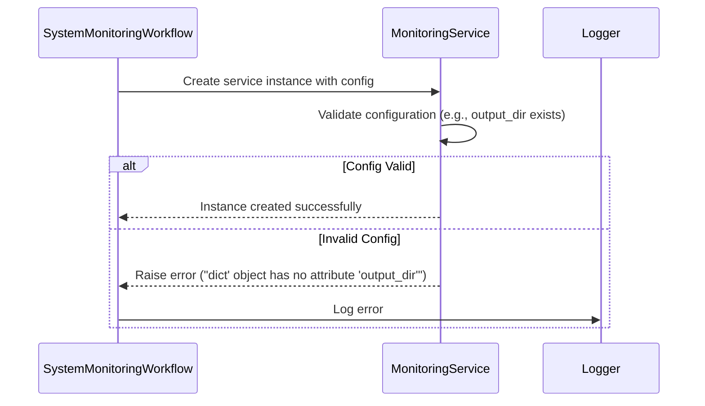
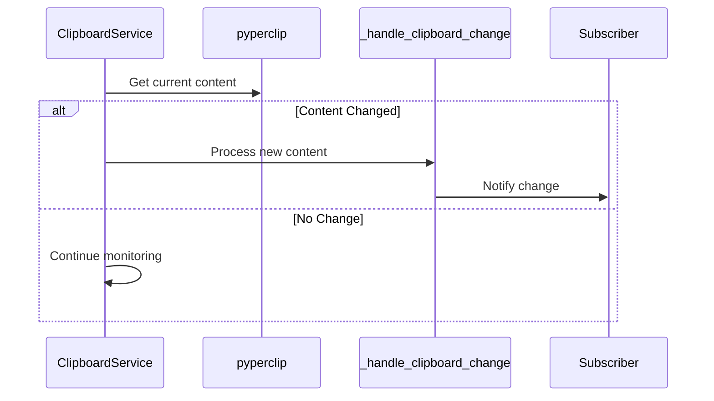
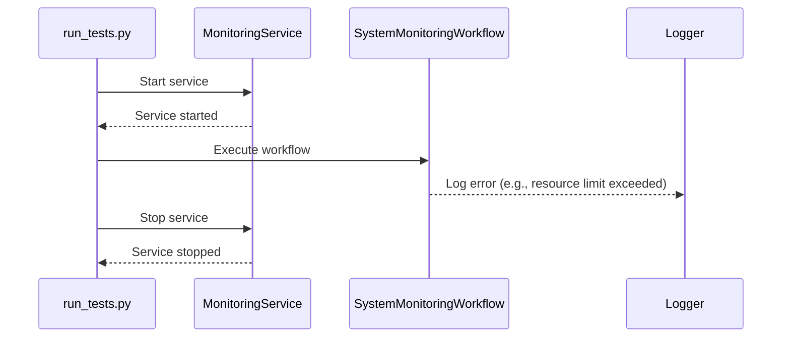

# System Context Monitor

A comprehensive system monitoring solution with cognitive workflows and enhanced security.

## Features

- Enhanced security with API key validation and rate limiting
- Comprehensive protocol validation for MCP messages
- Real-time monitoring through WebSocket connections
- Tool registry with validation and metrics collection
- Redis-based rate limiting and caching
- Structured logging with context tracking
- Extensive test coverage

## Installation

1. Clone the repository:
```bash
git clone https://github.com/yourusername/system-context-monitor.git
cd system-context-monitor
```

2. Install dependencies with Poetry:
```bash
poetry install
```

Or with pip:
```bash
pip install -r services/requirements.txt
```

3. Set up environment variables:
```bash
cp .env.example .env
# Edit .env with your configuration
```

4. Start Redis and PostgreSQL:
```bash
docker-compose up -d redis db
```

5. Run database migrations:
```bash
poetry run alembic upgrade head
```

## Development

1. Start the development server:
```bash
poetry run uvicorn services.api.main:app --reload
```

2. Run tests:
```bash
poetry run pytest tests/
```

3. Run linting:
```bash
poetry run black services/
poetry run isort services/
poetry run mypy services/
```

## API Documentation

Once running, visit:
- OpenAPI documentation: http://localhost:8000/docs
- ReDoc documentation: http://localhost:8000/redoc

## Architecture

The System Context Monitor is built with:
- FastAPI for high-performance API endpoints
- WebSocket support for real-time monitoring
- Redis for rate limiting and caching
- PostgreSQL for persistent storage
- Structured logging with context tracking
- Comprehensive test suite

### Security Features

- API key validation
- Rate limiting with Redis
- Protocol validation for all messages
- Security headers
- CORS configuration
- Input validation with Pydantic

### Monitoring Features

- Real-time system metrics
- Tool execution metrics
- Error tracking and categorization
- Performance monitoring
- Resource usage tracking

## Contributing

1. Fork the repository
2. Create a feature branch
3. Make your changes
4. Run tests and linting
5. Submit a pull request

## License

This project is licensed under the MIT License - see the LICENSE file for details.

## Acknowledgments

- Material-UI for the component library
- FastAPI for the backend framework
- Docker for containerization
- The open-source community for various tools and libraries

Below is the new `diagrams.md` file containing the requested Mermaid diagrams. All diagrams have been created following the Mermaid Diagram Generator standards (mermaid-generator.mdc), including proper syntax validation, incremental building, and style management.

---

# Diagrams for the System Context Monitor

This file includes multiple Mermaid diagrams documenting the architecture, workflows, and processes of our System Context Monitor codebase.

---

## 1. High-Level Code Structure Diagram

This diagram visualizes the overall directory structure and main modules in the project.



---

## 2. System Monitoring Workflow Flow Diagram

This flowchart illustrates the process within the SystemMonitoringWorkflow—from context validation to service initialization, concurrent monitoring, and error handling.



---

## 3. Cognitive Orchestrator Workflow Execution Sequence Diagram

This sequence diagram details how the CognitiveOrchestrator executes a workflow, including context validation, resource checks, execution, and state updates.



---

## 4. Context Management Flow Diagram

This diagram highlights the process of adding context data and notifying subscribers via the ContextShepherd module.



---

## 5. Monitoring Service Lifecycle Diagram

This flowchart outlines the lifecycle of a monitoring service—from initialization and metric collection to error handling and cleanup.



---

## 6. Service Initialization Error Handling Diagram

This sequence diagram visualizes the error handling flow during service initialization, especially when configuration data is invalid.



---

## 7. Clipboard Service Monitoring Flow Diagram

This diagram shows the flow of clipboard monitoring—from periodic checking to detecting content changes and notifying subscribers.



---

## 8. Test Execution Flow Diagram

This diagram illustrates the overall test execution flow, highlighting service startup, workflow execution, error logging, and cleanup sequences.


