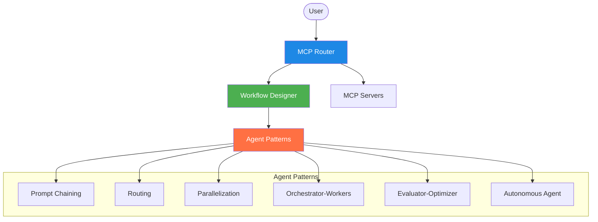

# MCP Router with LLM Agent Workflows

A comprehensive router for Model Context Protocol (MCP) servers with an integrated LLM Agent Workflow Designer.

## Overview

The MCP Router enables communication between various MCP clients and servers, providing a central hub for managing AI workflows through the Model Context Protocol. Its LLM Agent Workflow Designer allows for visual creation of sophisticated agent patterns as described in Anthropic's "Building Effective Agents" guide.



## Features

- **Advanced MCP Protocol Network Routing**: Connect and manage multiple MCP servers
- **LLM Agent Workflow Designer**: Create, monitor, and deploy agent workflows using visual tools
- **Agent Pattern Library**: Implement architectures from Anthropic's agent design patterns
- **Integrated Mermaid Diagrams**: Visualize and document workflows with automatic diagram generation
- **Advanced Testing Framework**: Test and simulate agent workflows before deployment
- **Comprehensive Monitoring**: Track performance metrics and diagnose issues

## Project Structure

The project has been restructured into a monorepo with clear package boundaries:

```
mcp-router/
├── packages/               # Main packages directory
│   ├── frontend/           # React frontend application
│   ├── backend/            # Backend services and API
│   └── shared/             # Shared code between frontend and backend
├── infra/                  # Infrastructure configuration
│   ├── docker/             # Docker configurations
│   └── nginx/              # Nginx configuration
├── docs/                   # Project documentation
├── scripts/                # Build and deployment scripts
└── config/                 # Project-wide configuration
```

### Packages

#### Frontend (`packages/frontend`)

The frontend package contains the React application, organized by features:

```
frontend/
├── public/                 # Static assets
└── src/                    # Source code
    ├── features/           # Feature modules
    │   ├── workflow-designer/    # Workflow designer feature
    │   │   ├── components/       # React components
    │   │   │   ├── Canvas/       # Canvas component
    │   │   │   ├── NodePalette/  # Node palette component
    │   │   │   ├── PropertiesPanel/ # Properties panel
    │   │   │   └── Nodes/        # Node components
    │   │   ├── hooks/            # React hooks
    │   │   └── contexts/         # React contexts
    │   ├── mermaid-integration/  # Mermaid integration feature
    │   └── improvements/         # Code improvements feature
    ├── assets/              # Assets (images, etc.)
    └── utils/               # Utility functions
```

#### Backend (`packages/backend`)

The backend package contains the server-side code:

```
backend/
├── src/                     # Source code
│   ├── api/                 # API endpoints
│   ├── services/            # Service implementations
│   │   ├── analyzers/       # Code analyzers
│   │   ├── mcp/             # MCP services
│   │   │   ├── context/     # Context services
│   │   └── system-monitor/  # System monitoring
│   ├── core/                # Core functionality
│   │   ├── router/          # Router implementation
│   │   └── discovery/       # Server discovery
│   ├── db/                  # Database access
│   │   └── migrations/      # Database migrations
│   └── utils/               # Utility functions
└── tests/                   # Backend tests
```

#### Shared (`packages/shared`)

The shared package contains code used by both frontend and backend:

```
shared/
└── src/                     # Source code
    ├── types/               # TypeScript type definitions
    ├── client/              # Client implementations
    ├── server/              # Server implementations
    └── utils/               # Shared utilities
```

## Migration Status

The project has been restructured from the old organization to the new monorepo structure. Key components have been moved to their appropriate locations:

- Frontend components have been migrated to `packages/frontend/src/features/`
- Backend services have been migrated to `packages/backend/src/services/`
- Shared code has been migrated to `packages/shared/src/`

For detailed migration status, see [refactoring.md](docs/refactoring.md).

## Migration Tools

Several scripts have been created to assist with the migration process:

- `scripts/migrate_remaining.sh`: Script for migrating files to the new structure
- `scripts/update_imports.sh`: Script for updating import paths in the migrated files
- `scripts/deduplicate_files.sh`: Script for handling files that exist in multiple locations

## Development

### Prerequisites

- Node.js (v16+)
- Docker and Docker Compose
- Python 3.9+

### Getting Started

1. Clone the repository:
   ```
   git clone https://github.com/yourusername/mcp-router.git
   cd mcp-router
   ```

2. Install dependencies for all packages:
   ```
   npm install
   ```

3. Start the development environment:
   ```
   docker-compose up -d
   ```

4. Start both frontend and backend development servers:
   ```
   npm run dev
   ```

   Alternatively, you can start them separately:
   ```
   # Start frontend only
   npm run start:frontend

   # Start backend only
   npm run start:backend
   ```

### Building

To build all packages:

```
npm run build
```

To build individual packages:

```
npm run build:frontend
npm run build:backend
npm run build:shared
```

### Project Structure Details

The monorepo is organized into three main packages:

1. **Frontend Package** (`packages/frontend`):
   - React application for the user interface
   - Features-based organization
   - Components for workflow design, monitoring, and visualization

2. **Backend Package** (`packages/backend`):
   - Node.js/Express server
   - MCP routing functionality
   - System monitoring and persistence

3. **Shared Package** (`packages/shared`):
   - Common types and utilities used by both frontend and backend
   - MCP client and server implementations
   - Transport layer abstractions

### Importing Between Packages

When importing from one package to another, use the `@mcp-router` namespace:

```typescript
// Importing from shared package in frontend or backend
import { MCPClient } from '@mcp-router/shared/client/MCPClient';

// Importing from within the same package
import { Button } from '../../components/ui/Button';
```

## License

[Add license information here]

## Contributing

[Add contribution guidelines here]

## Current Status

The project is currently undergoing a major restructuring to migrate from the original directory structure to a modern monorepo structure. The following has been completed:

✅ All files have been migrated to the new monorepo structure  
✅ Original directories (`src/` and `services/`) have been removed  
✅ Import paths have been partially updated  
✅ Package configurations have been set up  

### Remaining Tasks

The following tasks are still in progress:

- Finishing import path updates (there are still some incorrect references)
- Completing TypeScript configuration for all packages
- Setting up proper build pipeline
- Testing the application with the new structure

### Known Issues

- Some import paths may still reference the old directory structure
- You may need to manually update imports when working with specific files
- The build process may fail until all import paths are fixed

If you encounter issues, please check [docs/refactoring.md](docs/refactoring.md) for details on the migration progress.
