# System Architecture Documentation

## Overview

The System Context Monitor is built using a modern, scalable architecture that emphasizes real-time monitoring, efficient state management, and robust error handling.

## System Components

```mermaid
%%{
  init: {
    'theme': 'base',
    'themeVariables': {
      'primaryColor': '#2ecc71',
      'primaryTextColor': '#fff',
      'primaryBorderColor': '#27ae60',
      'lineColor': '#3498db',
      'secondaryColor': '#e74c3c',
      'tertiaryColor': '#9b59b6',
      'mainBkg': '#ffffff',
      'nodeBorder': '#2c3e50',
      'clusterBkg': '#f8f9fa',
      'clusterBorder': '#dee2e6'
    }
  }
}%%
graph TD
    %% Node Styling
    classDef default fill:#f9f9f9,stroke:#333,stroke-width:1px;
    classDef primary fill:#2ecc71,stroke:#27ae60,color:#fff,stroke-width:2px;
    classDef secondary fill:#3498db,stroke:#2980b9,color:#fff,stroke-width:2px;
    classDef storage fill:#e74c3c,stroke:#c0392b,color:#fff,stroke-width:2px;

    subgraph Frontend["Frontend Layer"]
        UI["🖥️ React UI"]
        Store["💾 Zustand Store"]
        MCP["🔌 MCP Provider"]
        ErrorB["⚠️ Error Boundaries"]
        
        UI --> Store
        UI --> MCP
        UI --> ErrorB
    end

    subgraph API["API Layer"]
        APIGw["🌐 FastAPI Server"]
        WS["🔌 WebSocket Server"]
        Auth["🔒 Authentication"]
        Rate["⚡ Rate Limiter"]
        
        APIGw --> WS
        APIGw --> Auth
        APIGw --> Rate
    end

    subgraph Service["Service Layer"]
        MS["📊 Monitoring Service"]
        CS["💾 Context Service"]
        WF["⚙️ Workflow Service"]
        
        MS --> CS
        WF --> CS
    end

    subgraph Data["Data Layer"]
        Cache["📦 Redis Cache"]
        DB["🗄️ State Store"]
        Queue["📨 Message Queue"]
        
        Cache --> DB
        Queue --> DB
    end

    UI <--> APIGw
    MCP <--> WS
    APIGw <--> MS
    APIGw <--> WF
    MS --> Queue
    WF --> Queue

    %% Apply styles
    class UI,Store,MCP,ErrorB primary;
    class APIGw,WS,Auth,Rate secondary;
    class MS,CS,WF secondary;
    class Cache,DB,Queue storage;
```



## Component Details

### Frontend Components

1. **Dashboard (SystemContextDashboard)**
   - Main application container
   - Manages global state and routing
   - Handles error boundaries

2. **Monitoring Panel**
   - Displays real-time monitoring data
   - Manages tab-based navigation
   - Handles data visualization

3. **Context Viewer**
   - Shows current system context
   - Provides context manipulation
   - Real-time updates

4. **Workflow Manager**
   - Workflow CRUD operations
   - Status monitoring
   - Error handling

5. **QR Display**
   - Context sharing
   - Mobile integration
   - Dynamic updates

### State Management

```mermaid
%%{
  init: {
    'theme': 'base',
    'themeVariables': {
      'primaryColor': '#3498db',
      'primaryTextColor': '#fff',
      'primaryBorderColor': '#2980b9',
      'lineColor': '#2c3e50',
      'secondaryColor': '#e74c3c',
      'mainBkg': '#ffffff',
      'nodeBorder': '#2c3e50'
    }
  }
}%%
graph LR
    %% Node Styling
    classDef default fill:#f9f9f9,stroke:#333,stroke-width:1px;
    classDef store fill:#3498db,stroke:#2980b9,color:#fff,stroke-width:2px;
    classDef cache fill:#e74c3c,stroke:#c0392b,color:#fff,stroke-width:2px;
    classDef queue fill:#f1c40f,stroke:#f39c12,color:#fff,stroke-width:2px;

    subgraph Frontend["Frontend State"]
        ZS["⚙️ Zustand Store"]
        MC["🔌 MCP Context"]
        LC["💾 Local Cache"]
        
        ZS --> MC
        ZS --> LC
    end

    subgraph Backend["Backend State"]
        RS["📦 Redis Store"]
        PS["🗄️ Persistent Store"]
        MQ["📨 Message Queue"]
        
        RS --> PS
        MQ --> PS
    end

    ZS <--> RS
    MC <--> MQ

    %% Apply styles
    class ZS,MC store;
    class LC,RS,PS cache;
    class MQ queue;
```



### Data Flow

1. **Monitoring Data Flow**
   ```mermaid
   %%{
     init: {
       'theme': 'base',
       'themeVariables': {
         'primaryColor': '#3498db',
         'primaryTextColor': '#fff',
         'primaryBorderColor': '#2980b9',
         'lineColor': '#2c3e50',
         'secondaryColor': '#e74c3c',
         'tertiaryColor': '#2ecc71',
         'actorBkg': '#f8f9fa',
         'actorBorder': '#2c3e50',
         'noteBkg': '#f8f9fa',
         'noteBorder': '#dee2e6'
       }
     }
   }%%
   sequenceDiagram
       participant UI as 🖥️ Frontend UI
       participant API as 🌐 API Gateway
       participant MS as 📊 Monitoring Service
       participant Q as 📨 Message Queue
       participant DB as 🗄️ State Store
       
       autonumber
       
       note over UI,API: Real-time Monitoring Flow
       UI->>+API: Request monitoring data
       API->>+MS: Forward request
       MS->>Q: Publish data
       Q->>DB: Store data
       DB-->>UI: Send updates via WebSocket
       
       note over MS,DB: Async Processing
       MS->>MS: Process metrics
       MS->>Q: Publish metrics
       Q->>DB: Store metrics
       
       note over UI,DB: Error Handling
       alt Error occurs
           DB-->>API: Error notification
           API-->>UI: Display error
       else Success
           DB-->>UI: Confirmation
       end
   ```

2. **Workflow Execution Flow**
   ```mermaid
   %%{
     init: {
       'theme': 'base',
       'themeVariables': {
         'primaryColor': '#3498db',
         'primaryTextColor': '#fff',
         'primaryBorderColor': '#2980b9',
         'lineColor': '#2c3e50',
         'secondaryColor': '#e74c3c',
         'actorBkg': '#f8f9fa',
         'actorBorder': '#2c3e50'
       }
     }
   }%%
   sequenceDiagram
       participant UI as 🖥️ Frontend
       participant WF as ⚙️ Workflow Service
       participant CS as 💾 Context Service
       participant DB as 🗄️ Database
       
       UI->>WF: Execute workflow
       WF->>CS: Get context
       CS->>DB: Update state
       DB-->>UI: Send state update
   ```

## Technical Specifications

### Frontend Stack


### Backend Stack


## Security Architecture

### Authentication Flow

```mermaid
%%{
  init: {
    'theme': 'base',
    'themeVariables': {
      'primaryColor': '#e74c3c',
      'primaryTextColor': '#fff',
      'primaryBorderColor': '#c0392b',
      'lineColor': '#2c3e50',
      'actorBkg': '#f8f9fa',
      'actorBorder': '#2c3e50'
    }
  }
}%%
sequenceDiagram
    participant Client as 🖥️ Client
    participant Auth as 🔒 Auth
    participant API as 🌐 API
    participant Service as ⚙️ Service
    
    Client->>Auth: Request access
    Auth->>Auth: Validate credentials
    Auth-->>Client: Issue token
    Client->>API: Request with token
    API->>Auth: Validate token
    Auth-->>API: Token valid
    API->>Service: Process request
```



### Security Measures

1. **Data Protection**
   - End-to-end encryption for sensitive data
   - Secure WebSocket connections
   - Rate limiting on API endpoints

2. **Access Control**
   - Role-based access control
   - Token-based authentication
   - Session management

3. **Resource Protection**
   - Request rate limiting
   - Data storage quotas
   - CPU/Memory restrictions

## Performance Optimization

### Frontend Optimization

1. **Component Optimization**
   - React.memo for pure components
   - Lazy loading for routes
   - Virtual scrolling for large lists

2. **State Management**
   - Selective state updates
   - Optimistic updates
   - Proper memoization

3. **Network Optimization**
   - Request batching
   - Data compression
   - Proper caching

### Backend Optimization

1. **API Optimization**
   - Response compression
   - Query optimization
   - Connection pooling

2. **Caching Strategy**
   - Redis for frequent data
   - In-memory caching
   - Cache invalidation

3. **Resource Management**
   - Worker processes
   - Connection pooling
   - Memory management

## Deployment Architecture

```mermaid
%%{
  init: {
    'theme': 'base',
    'themeVariables': {
      'primaryColor': '#3498db',
      'primaryTextColor': '#fff',
      'primaryBorderColor': '#2980b9',
      'lineColor': '#2c3e50',
      'nodeBorder': '#2c3e50',
      'clusterBkg': '#f8f9fa',
      'clusterBorder': '#dee2e6'
    }
  }
}%%
graph TD
    %% Node Styling
    classDef lb fill:#3498db,stroke:#2980b9,color:#fff,stroke-width:2px;
    classDef app fill:#2ecc71,stroke:#27ae60,color:#fff,stroke-width:2px;
    classDef data fill:#e74c3c,stroke:#c0392b,color:#fff,stroke-width:2px;

    subgraph Prod["Production Environment"]
        LB["⚖️ Load Balancer"]
        
        subgraph Apps["Application Servers"]
            API1["🌐 API Server 1"]
            API2["🌐 API Server 2"]
            WS1["🔌 WebSocket Server 1"]
            WS2["🔌 WebSocket Server 2"]
        end
        
        subgraph Data["Data Storage"]
            Redis["📦 Redis Cluster"]
            DB["🗄️ Database Cluster"]
            MQ["📨 Message Queue"]
        end
        
        LB --> API1 & API2
        LB --> WS1 & WS2
        API1 & API2 --> Redis
        API1 & API2 --> DB
        WS1 & WS2 --> MQ
    end

    %% Apply styles
    class LB lb;
    class API1,API2,WS1,WS2 app;
    class Redis,DB,MQ data;
```



## Error Handling

### Error Categories

1. **Frontend Errors**
   - Network errors
   - State management errors
   - Rendering errors

2. **Backend Errors**
   - API errors
   - Service errors
   - Database errors

### Error Recovery

```mermaid
%%{
  init: {
    'theme': 'base',
    'themeVariables': {
      'primaryColor': '#e74c3c',
      'primaryTextColor': '#fff',
      'primaryBorderColor': '#c0392b',
      'lineColor': '#2c3e50',
      'actorBkg': '#f8f9fa',
      'actorBorder': '#2c3e50',
      'noteBkg': '#f8f9fa',
      'noteBorder': '#dee2e6'
    }
  }
}%%
sequenceDiagram
    participant UI as 🖥️ Frontend UI
    participant API as 🌐 API Gateway
    participant Service as ⚙️ Service Layer
    participant DB as 🗄️ Database
    
    autonumber
    
    note over UI,DB: Error Detection & Recovery
    UI->>+API: Initial request
    API->>Service: Process request
    Service->>DB: Database operation
    
    alt Database Error
        DB-->>Service: Operation failed
        Service-->>API: Service error
        API-->>UI: Show error UI
        note over UI: Implement retry logic
        UI->>API: Retry request
        API->>Service: Reprocess
        Service->>DB: Retry operation
        DB-->>UI: Success response
    else Network Error
        API-->>UI: Network failed
        note over UI: Auto-reconnect
        UI->>API: Reconnect
        API-->>UI: Connection restored
    else Service Error
        Service-->>API: Service failed
        API-->>UI: Service error
        note over UI: Fallback logic
        UI->>API: Use fallback
        API-->>UI: Fallback response
    end
```



## Monitoring and Logging

### System Monitoring Flow

```mermaid
%%{
  init: {
    'theme': 'base',
    'themeVariables': {
      'primaryColor': '#3498db',
      'primaryTextColor': '#fff',
      'primaryBorderColor': '#2980b9',
      'lineColor': '#2c3e50',
      'secondaryColor': '#e74c3c',
      'tertiaryColor': '#2ecc71',
      'actorBkg': '#f8f9fa',
      'actorBorder': '#2c3e50',
      'noteBkg': '#f8f9fa',
      'noteBorder': '#dee2e6'
    }
  }
}%%
sequenceDiagram
    participant UI as 🖥️ Frontend
    participant MS as 📊 Monitoring Service
    participant MQ as 📨 Message Queue
    participant DB as 🗄️ Database
    participant Log as Logger
    
    autonumber
    
    note over UI,Log: Real-time Monitoring Workflow
    
    UI->>+MS: Initialize monitoring
    activate MS
    
    par Screenshot Monitoring
        MS->>MS: Capture screenshot
        MS->>MQ: Publish screenshot
        MQ->>DB: Store screenshot
        DB-->>UI: Update UI
    and Clipboard Monitoring
        MS->>MS: Monitor clipboard
        MS->>MQ: Publish changes
        MQ->>DB: Store changes
        DB-->>UI: Update UI
    and Network Monitoring
        MS->>MS: Track network
        MS->>MQ: Publish activity
        MQ->>DB: Store activity
        DB-->>UI: Update UI
    end
    
    alt Error Occurs
        MS->>Log: Log error
        Log-->>UI: Show error
        note over MS: Implement recovery
    else Resource Limit
        MS->>Log: Log warning
        MS->>MS: Adjust sampling
    end
    
    note over UI,Log: Continuous Monitoring Loop
    
    deactivate MS
```



### Logging Architecture


## Future Considerations

1. **Scalability**
   - Horizontal scaling
   - Microservices architecture
   - Distributed caching

2. **Features**
   - AI-powered analysis
   - Advanced visualization
   - Mobile applications

3. **Integration**
   - Third-party services
   - API marketplace
   - Plugin system

## Component Architecture

### Frontend Component Structure


### Service Layer Architecture


### Data Flow Architecture


### State Management Architecture


### Error Handling Architecture


These diagrams provide a comprehensive view of:
1. Frontend component relationships and hierarchy
2. Service layer abstraction and implementation
3. Data flow through the system
4. State management architecture
5. Error handling patterns and recovery strategies

Would you like me to:
1. Add more detailed class diagrams for specific components?
2. Create diagrams for other architectural aspects?
3. Add more detailed relationships between components?
4. Include implementation details in the diagrams?

### Monitoring Architecture


### Testing Architecture


### Container Architecture


Now, let me create a Podman/Docker compose file to orchestrate these containers. 