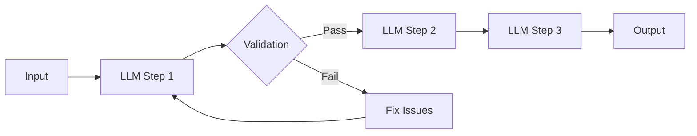
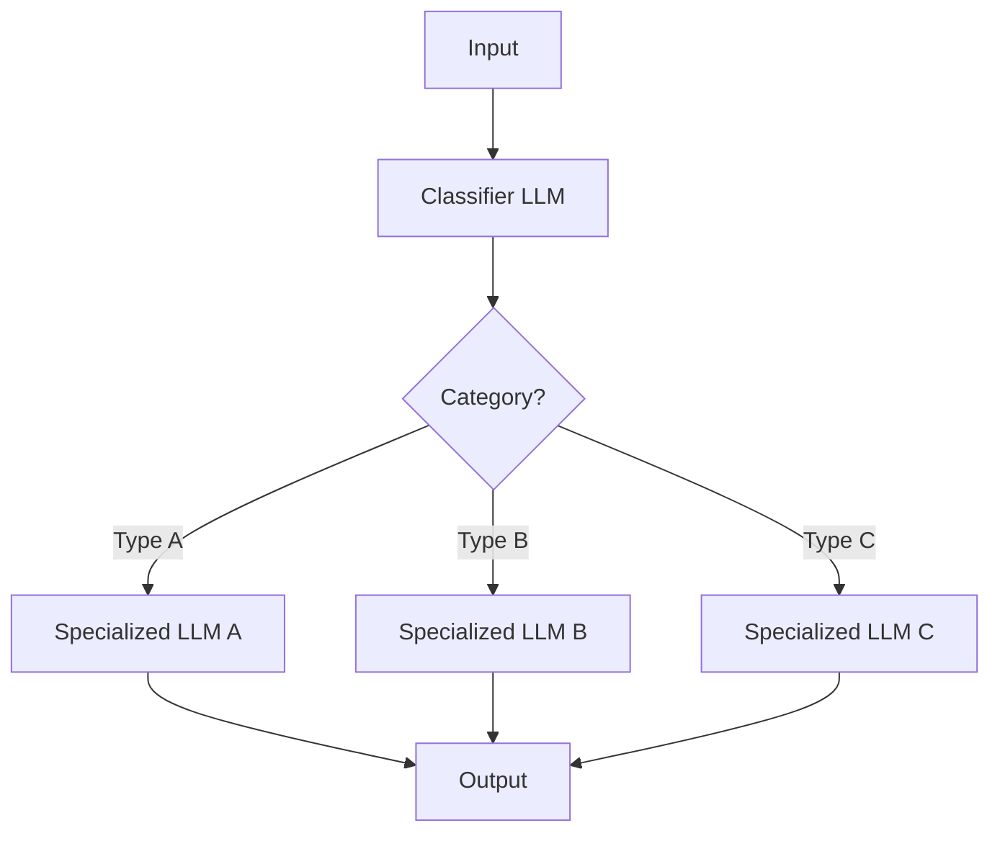
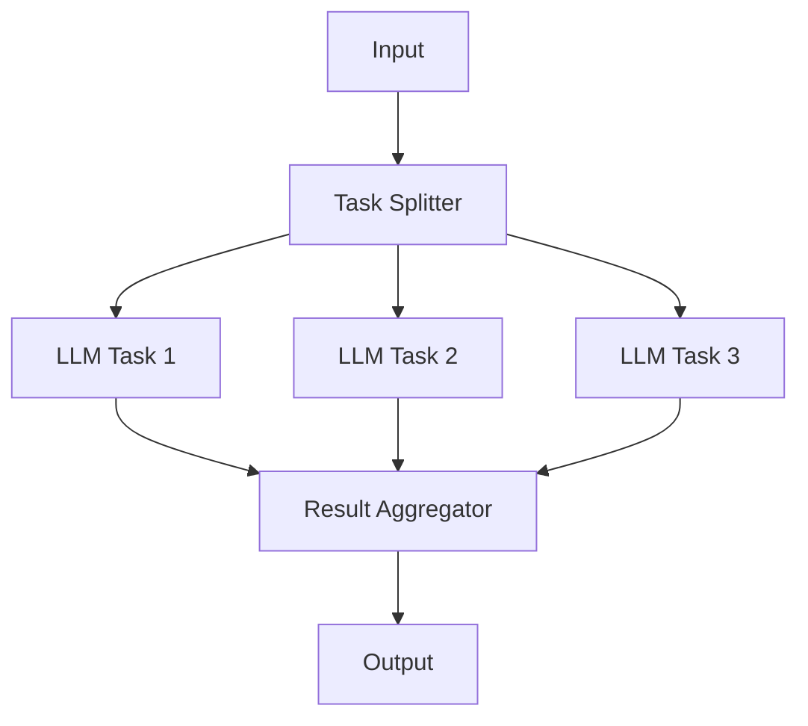
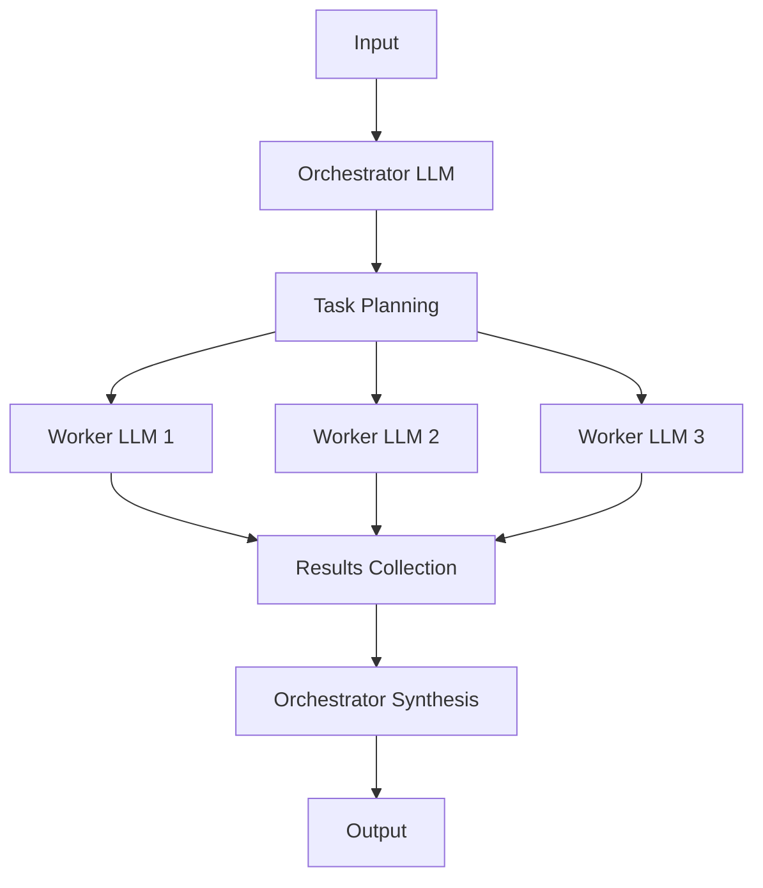
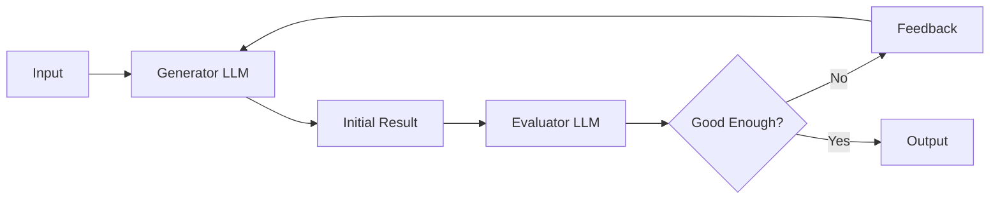
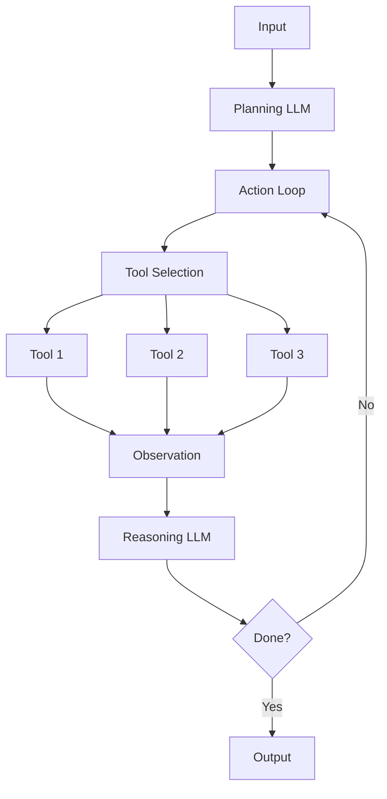
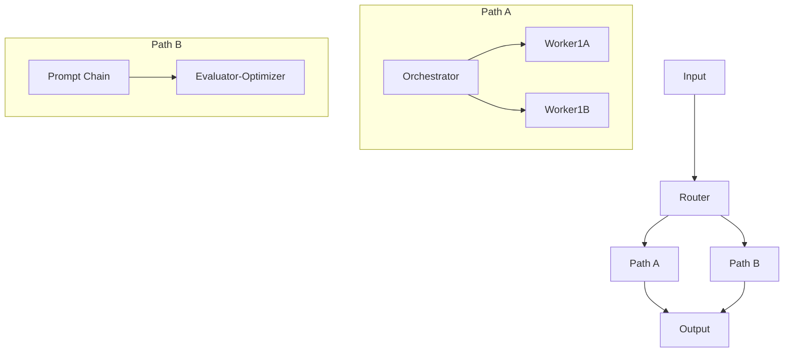

# LLM Agent Patterns

This document outlines the key agent design patterns supported by the LLM Agent Workflow Designer, based on Anthropic's "Building Effective Agents" framework.

## Introduction

LLM Agent patterns represent proven architectures for building effective AI systems using large language models. Each pattern is optimized for different use cases and offers unique benefits. The Workflow Designer implements these patterns as ready-to-use templates that can be customized for your specific needs.

## Core Patterns

### 1. Prompt Chaining

**Description**: Decomposes a task into sequential steps, with each LLM call processing the output of the previous one, optionally with validation gates.

**When to use**:
- Tasks that can be cleanly broken into ordered subtasks
- When accuracy is more important than latency
- For complex tasks where step-by-step validation is needed

**Examples**:
- Document generation with outline creation, content writing, and editing phases
- Multi-stage content transformation (e.g., draft → refine → translate)
- Step-by-step reasoning for complex problems

### 2. Routing

**Description**: Classifies input and directs it to specialized downstream tasks, allowing for optimized handling of different input types.

**When to use**:
- Tasks involving multiple distinct input categories
- When specialized handling per category improves quality
- For cost optimization by routing to appropriate model sizes

**Examples**:
- Customer support systems routing requests by type
- Content moderation with specialized detectors
- Multi-language processing with language-specific models

### 3. Parallelization

**Description**: Divides work into independent subtasks that run concurrently, with results aggregated afterward. Supports both "sectioning" (different subtasks) and "voting" (same task multiple times).

**When to use**:
- Tasks with independent components that can run in parallel
- When multiple perspectives improve outcome quality
- For faster processing of complex tasks

**Examples**:
- Document analysis across multiple sections or aspects
- Guardrails with separate content and safety evaluation
- Voting-based approaches for accuracy-critical applications

### 4. Orchestrator-Workers

**Description**: Uses a central orchestrator LLM to dynamically break down tasks, delegate to specialized workers, and synthesize results.

**When to use**:
- Complex tasks where subtasks aren't known in advance
- When specialized workers provide better results than a general approach
- For tasks requiring coordination of multiple AI components

**Examples**:
- Software development with multi-file changes
- Research tasks requiring diverse information gathering
- Complex project planning with dynamic subtask allocation

### 5. Evaluator-Optimizer

**Description**: Implements iterative refinement where one LLM generates content and another evaluates it, providing feedback for improvements.

**When to use**:
- Tasks where quality can be iteratively improved
- When clear evaluation criteria exist
- For outputs requiring high precision or creativity

**Examples**:
- Content creation with quality feedback loops
- Code generation with automated review and refinement
- Translation with iterative quality improvements

### 6. Autonomous Agent

**Description**: Empowers an LLM to operate independently over multiple steps, planning actions, using tools, and learning from environmental feedback.

**When to use**:
- Open-ended tasks where steps aren't predictable
- When environment interaction is needed
- For tasks requiring adaptive behavior

**Examples**:
- Software development agents
- Customer support agents with system access
- Research agents integrating multiple data sources

## Combining Patterns

These patterns can be combined to create more sophisticated architectures:

The Workflow Designer allows drag-and-drop composition of these patterns to create hybrid architectures tailored to specific use cases.

## Implementation Guidelines

When implementing these patterns:

1. **Start Simple**: Begin with the simplest pattern that might work
2. **Measure Performance**: Quantify improvements from each pattern
3. **Optimize Cost**: Consider the latency and token usage tradeoffs
4. **Test Thoroughly**: Validate across diverse inputs
5. **Human Oversight**: Design appropriate human touchpoints

## Examples

The Workflow Designer includes ready-to-customize examples for common use cases:

- Customer Support Agent
- Content Creation Pipeline
- Research Assistant
- Coding Assistant
- Data Analysis Workflow
