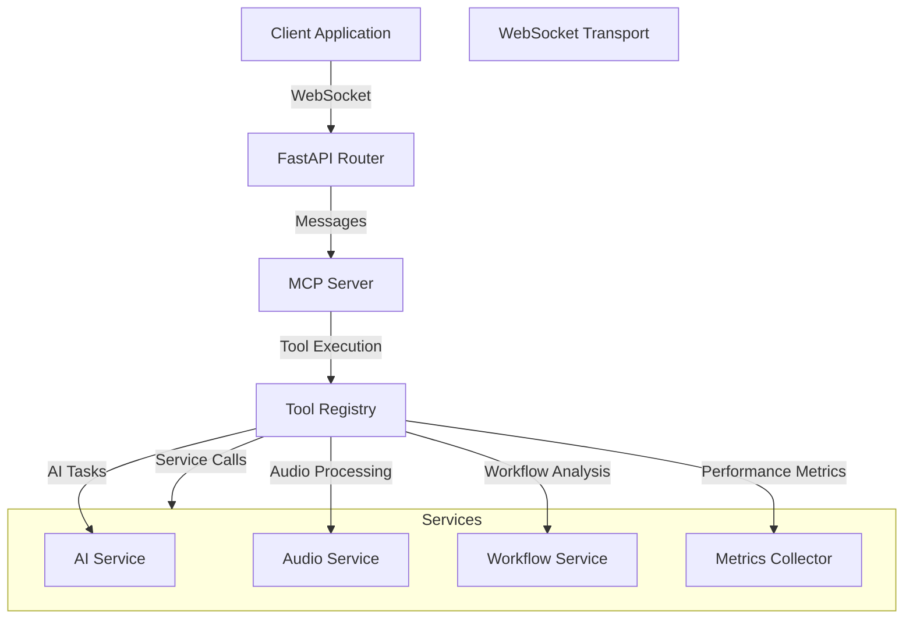
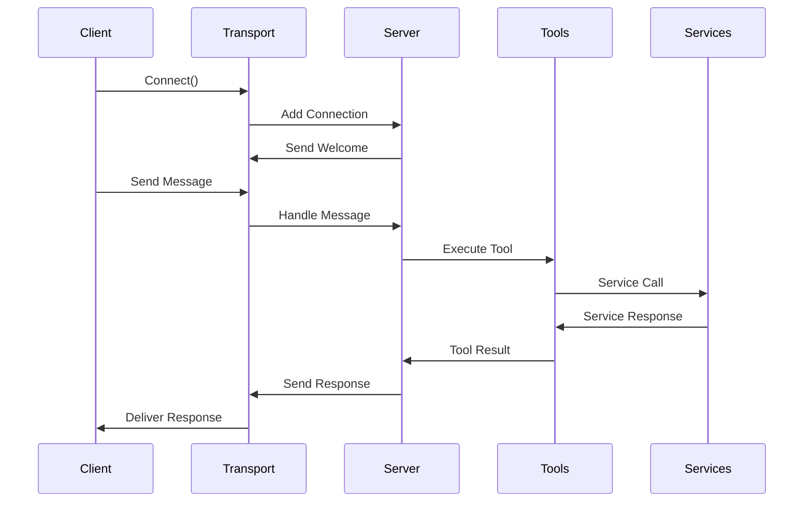
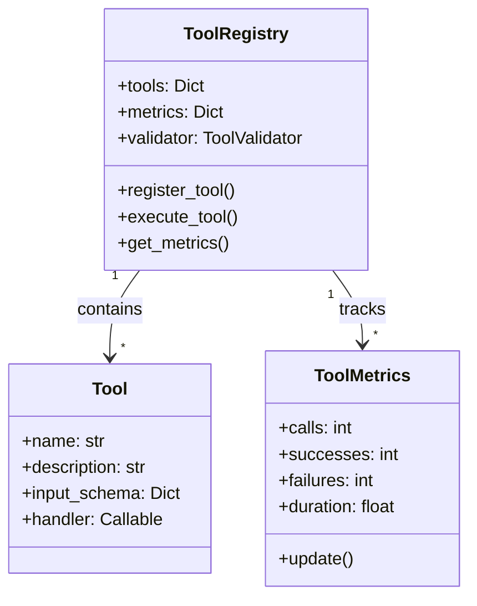
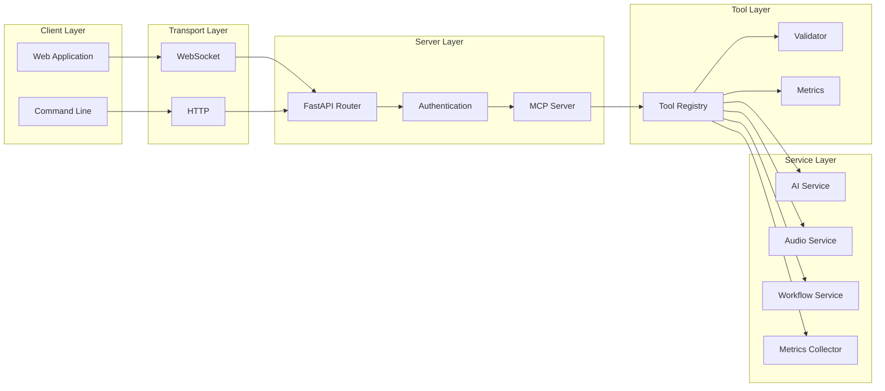
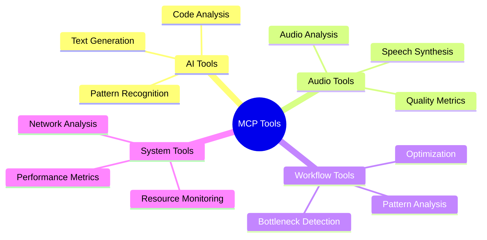
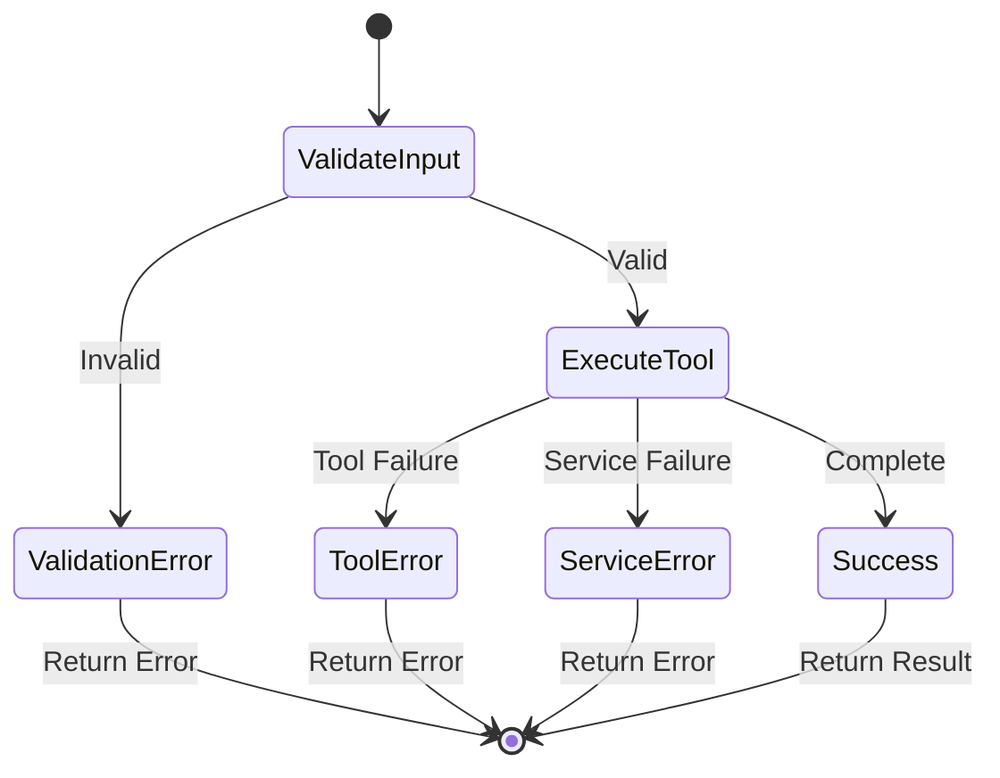
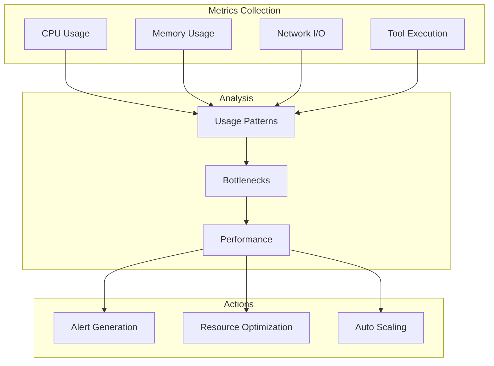
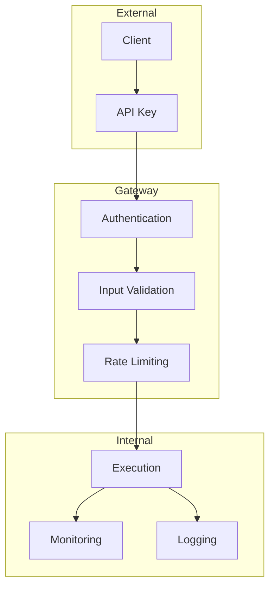
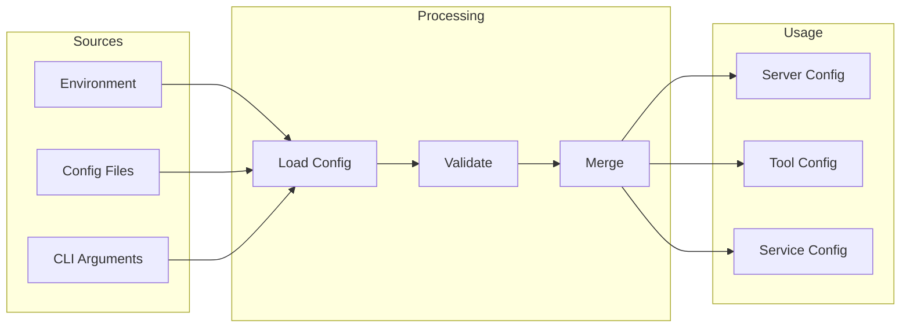

# MCP Architecture Documentation

## Overview

The Model Context Protocol (MCP) implementation provides a robust framework for managing AI model interactions, tool execution, and system monitoring. This document outlines the architecture, components, and workflows of the system.

## System Architecture



## Message Flow



## Tool Registry Structure



## Component Interactions



## Tool Categories



## Error Handling Flow



## Performance Monitoring



## Security Architecture



## Configuration Management



## Implementation Guidelines

1. **Transport Layer**
   - Implement proper connection management
   - Handle WebSocket lifecycle events
   - Maintain connection metrics

2. **Message Handling**
   - Validate all incoming messages
   - Implement proper error handling
   - Support streaming responses

3. **Tool Implementation**
   - Follow SOLID principles
   - Implement proper validation
   - Include comprehensive metrics

4. **Service Integration**
   - Use dependency injection
   - Implement proper interfaces
   - Handle service errors gracefully

5. **Security Considerations**
   - Validate API keys
   - Implement rate limiting
   - Sanitize all inputs

6. **Performance Optimization**
   - Use connection pooling
   - Implement caching where appropriate
   - Monitor resource usage

7. **Testing Requirements**
   - Write comprehensive unit tests
   - Include integration tests
   - Test error scenarios

## API Documentation

### WebSocket Endpoint

```typescript
interface Message {
    id: string;
    method: string;
    params: Record<string, any>;
}

interface Response {
    id: string;
    result?: any;
    error?: {
        code: string;
        message: string;
    };
}
```

### Available Tools

1. **AI Tools**
   - `ai/generate`: Generate AI responses
   - `code/analyze`: Analyze code quality

2. **Workflow Tools**
   - `workflow/analyze`: Analyze workflow patterns
   - `workflow/optimize`: Optimize workflow execution

3. **System Tools**
   - `system/metrics`: Get system metrics
   - `system/network`: Get network information

4. **Audio Tools**
   - `audio/synthesize`: Convert text to speech
   - `audio/analyze`: Analyze audio quality

## Deployment Guide

1. **Environment Setup**
   ```bash
   # Set required environment variables
   export MCP_HOST=localhost
   export MCP_PORT=8080
   export MCP_API_KEY=your-secret-key
   ```

2. **Running the Server**
   ```bash
   # Start the server
   uvicorn services.api.main:app --host $MCP_HOST --port $MCP_PORT
   ```

3. **Monitoring**
   ```bash
   # Check server status
   curl http://localhost:8080/api/mcp/status -H "X-API-Key: your-secret-key"
   ```

## Contributing

1. Follow the coding standards
2. Write comprehensive tests
3. Update documentation
4. Create detailed pull requests 