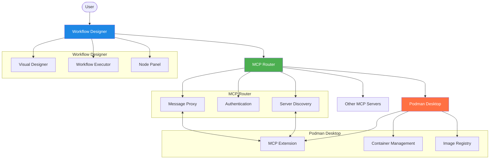
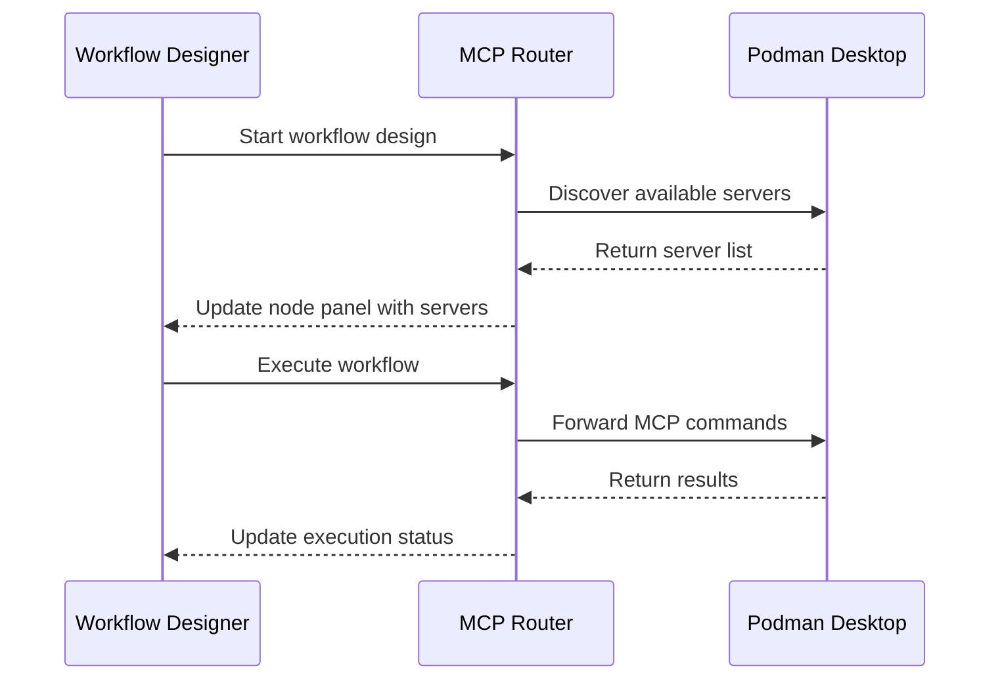
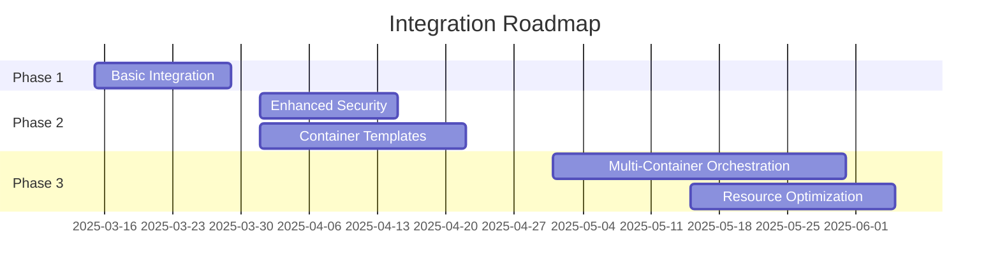

# MCP Workflow Designer Integration Guide

This guide explains how to integrate the MCP Workflow Designer with the Podman Desktop Extension and other MCP servers.

## Architecture



## Integration with Podman Desktop Extension

### Configuration

To connect the Workflow Designer to the Podman Desktop Extension:

1. Ensure the Podman Desktop Extension is exposing its MCP server:

```javascript
// In Podman Desktop Extension (modelcontextprotocol-podman/src/extension.ts)
const defaultTransport: MCPServerTransport = {
  type: 'http-sse',
  port: 3000,
  host: '0.0.0.0', // Allow external connections
  basePath: '/api/v1'
};
```

2. Configure the MCP Router to connect to the Podman Extension:

```javascript
// In MCP Router configuration
{
  "externalServers": [
    {
      "name": "podman-desktop-mcp",
      "host": "localhost", // The host where Podman Desktop is running
      "port": 3000,
      "type": "podman-mcp",
      "auth": {
        "type": "none" // Or "token" if authentication is required
      }
    }
  ]
}
```

### Connection Flow



## Building and Testing

### Prerequisites

- Node.js 16+
- MCP Router running
- Podman Desktop with MCP extension installed

### Setup Steps

1. Configure MCP Router to connect to Podman Desktop

2. Start the development server:
```bash
cd frontend
npm start
```

3. Access the Workflow Designer at http://localhost:3000/workflows

### Testing Workflow

1. Create a new workflow
2. Add Podman server node
3. Connect to container-related tool nodes
4. Execute the workflow to verify connection

## Troubleshooting

### Common Issues

- **Connection failures**: Verify Podman Desktop is exposing the MCP server correctly
- **Missing tools**: Check that the Podman extension has properly registered its tools
- **Execution errors**: Examine logs in both applications for error details

## Security Considerations

- **Network Security**: Use TLS for production deployments
- **Authentication**: Implement token-based auth between components
- **Access Control**: Limit container operations to authorized workflows

## Future Enhancements


