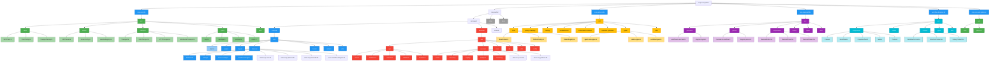

```mermaid
graph TD
    %% Root level structure - with separate repos
    Root["mcp-ecosystem/"] --> CoreRepo["mcp-core-lib/"]
    Root --> RouterRepo["mcp-router/"]
    Root --> PatternsRepo["mcp-patterns-lib/"]
    Root --> MermaidRepo["mcp-mermaid-lib/"]
    Root --> DesignerRepo["workflow-designer-lib/"]
    
    %% Alternative 1: Fully Separated Packages (illustrated above)

    %% Alternative 2: Monorepo with Improved Structure
    RouterRepo --> Packages["packages/"]
    RouterRepo --> Infra["infra/"]
    RouterRepo --> Docs["docs/"]
    
    %% Packages
    Packages --> Frontend["frontend/"]
    Packages --> Backend["backend/"]
    Packages --> Shared["shared/"]
    
    %% Core Library (extracted)
    CoreRepo --> CoreSrc["src/"]
    CoreSrc --> CoreClient["client/"]
    CoreSrc --> CoreServer["server/"]
    CoreSrc --> CoreTransport["transport/"]
    CoreSrc --> CoreTypes["types/"]
    CoreSrc --> CoreUtils["utils/"]
    
    %% CoreClient
    CoreClient --> BaseMCPClient["MCPClient.ts"]
    CoreClient --> ClientConfig["ClientConfig.ts"]
    CoreClient --> TransportFactory["TransportFactory.ts"]
    
    %% CoreServer
    CoreServer --> BaseMCPServer["MCPServer.ts"]
    CoreServer --> ServerConfig["ServerConfig.ts"]
    CoreServer --> HandlerRegistry["HandlerRegistry.ts"]
    
    %% CoreTransport
    CoreTransport --> BaseTransport["Transport.ts"]
    CoreTransport --> StdioTransport["StdioTransport.ts"]
    CoreTransport --> HTTPTransport["HTTPTransport.ts"]
    CoreTransport --> WSTransport["WebSocketTransport.ts"]
    
    %% CoreTypes
    CoreTypes --> BaseMCPTypes["mcp.ts"]
    CoreTypes --> MessageTypes["message.ts"]
    CoreTypes --> ProtocolTypes["protocol.ts"]
    CoreTypes --> ErrorTypes["errors.ts"]
    
    %% Agent Patterns Library (extracted)
    PatternsRepo --> PatternsSrc["src/"]
    PatternsSrc --> CorePatterns["core/"]
    PatternsSrc --> PromptChaining["prompt-chaining/"]
    PatternsSrc --> Routing["routing/"]
    PatternsSrc --> Parallelization["parallelization/"]
    PatternsSrc --> OrchestratorWorkers["orchestrator-workers/"]
    PatternsSrc --> EvaluatorOptimizer["evaluator-optimizer/"]
    PatternsSrc --> PatternsTypes["types/"]
    PatternsSrc --> PatternsUtils["utils/"]
    
    %% CorePatterns
    CorePatterns --> BasePattern["BasePattern.ts"]
    CorePatterns --> PatternFactory["PatternFactory.ts"]
    CorePatterns --> PatternRegistry["PatternRegistry.ts"]
    
    %% PatternsTypes
    PatternsTypes --> AgentNodeTypes["agent-node-types.ts"]
    PatternsTypes --> PatternTypes["pattern-types.ts"]
    PatternsTypes --> WorkflowTypes["workflow-types.ts"]
    
    %% Mermaid Integration Library (extracted)
    MermaidRepo --> MermaidSrc["src/"]
    MermaidSrc --> MermaidGen["generator/"]
    MermaidSrc --> MermaidParse["parser/"]
    MermaidSrc --> MermaidComponents["components/"]
    MermaidSrc --> MermaidHooks["hooks/"]
    MermaidSrc --> MermaidTypes["types/"]
    MermaidSrc --> MermaidUtils["utils/"]
    
    %% MermaidComponents
    MermaidComponents --> MermaidEditor["MermaidEditor.tsx"]
    MermaidComponents --> MermaidPanel["MermaidPanel.tsx"]
    MermaidComponents --> MermaidViewer["MermaidViewer.tsx"]
    
    %% MermaidGen
    MermaidGen --> WorkflowToMermaid["workflow-to-mermaid.ts"]
    MermaidGen --> DiagramStyles["diagram-styles.ts"]
    
    %% MermaidParse
    MermaidParse --> MermaidToWorkflow["mermaid-to-workflow.ts"]
    MermaidParse --> DiagramParser["diagram-parser.ts"]
    
    %% Workflow Designer Library (extracted)
    DesignerRepo --> DesignerSrc["src/"]
    DesignerSrc --> DesignerComponents["components/"]
    DesignerSrc --> DesignerHooks["hooks/"]
    DesignerSrc --> DesignerContext["context/"]
    DesignerSrc --> DesignerTypes["types/"]
    DesignerSrc --> DesignerUtils["utils/"]
    
    %% DesignerComponents
    DesignerComponents --> Canvas["Canvas/"]
    DesignerComponents --> NodePalette["NodePalette/"]
    DesignerComponents --> PropPanel["PropertiesPanel/"]
    DesignerComponents --> NodeTypes["Nodes/"]
    DesignerComponents --> Controls["Controls/"]
    
    %% DesignerContext
    DesignerContext --> WorkflowCtx["WorkflowContext.tsx"]
    DesignerContext --> SelectionCtx["SelectionContext.tsx"]
    DesignerContext --> HistoryCtx["HistoryContext.tsx"]
    
    %% Frontend (Improved)
    Frontend --> FSrc["src/"]
    FSrc --> FApp["App.tsx"]
    FSrc --> FPages["pages/"]
    FSrc --> FLayout["layout/"]
    FSrc --> FFeatures["features/"]
    FSrc --> FHooks["hooks/"]
    FSrc --> FContext["context/"]
    FSrc --> FUtils["utils/"]
    
    %% Frontend Features - Now using extracted libraries
    FFeatures --> Dashboard["dashboard/"]
    FFeatures --> Settings["settings/"]
    FFeatures --> ServerManager["server-manager/"]
    FFeatures --> WorkflowManager["workflow-manager/"]
    
    %% Backend (Improved)
    Backend --> BSrc["src/"]
    BSrc --> BAPI["api/"]
    BSrc --> BServices["services/"]
    BSrc --> BCore["core/"]
    BSrc --> BDB["db/"]
    BSrc --> BUtils["utils/"]
    BSrc --> BConfig["config/"]
    
    %% Backend API - Improved structure
    BAPI --> APIRoutes["routes/"]
    BAPI --> APIMiddleware["middleware/"]
    BAPI --> APIControllers["controllers/"]
    BAPI --> APIValidators["validators/"]
    BAPI --> APISerializers["serializers/"]
    
    %% Backend Services - Better organization
    BServices --> RouterService["router/"]
    BServices --> Discovery["discovery/"]
    BServices --> Registry["registry/"]
    BServices --> Analytics["analytics/"]
    BServices --> Monitoring["monitoring/"]
    
    %% Integration with extracted libraries
    FFeatures --> CoreLib1["Uses mcp-core-lib"]
    FFeatures --> PatternsLib1["Uses mcp-patterns-lib"]
    FFeatures --> MermaidLib1["Uses mcp-mermaid-lib"]
    FFeatures --> DesignerLib1["Uses workflow-designer-lib"]
    
    BServices --> CoreLib2["Uses mcp-core-lib"]
    BServices --> PatternsLib2["Uses mcp-patterns-lib"]
    
    %% Alternative 3: Hybrid Approach With Core + Patterns in Same Repo
    Root --> HybridRepo["mcp-core-and-patterns/"]
    
    HybridRepo --> HybridSrc["src/"]
    HybridSrc --> HCore["core/"]
    HybridSrc --> HPatterns["patterns/"]
    
    %% Color definitions - Frontend (Blue)
    classDef frontendDir fill:#2196F3,stroke:#0D47A1,color:white
    classDef frontendFile fill:#90CAF9,stroke:#0D47A1
    classDef reactComponent fill:#64B5F6,stroke:#0D47A1
    
    %% Color definitions - Backend (Red)
    classDef backendDir fill:#F44336,stroke:#B71C1C,color:white
    classDef backendFile fill:#FFCDD2,stroke:#B71C1C
    classDef apiComponent fill:#E57373,stroke:#B71C1C
    
    %% Color definitions - Shared/Core Library (Green)
    classDef sharedDir fill:#4CAF50,stroke:#1B5E20,color:white
    classDef sharedFile fill:#A5D6A7,stroke:#1B5E20
    classDef typeFile fill:#81C784,stroke:#1B5E20
    
    %% Color definitions - Pattern Library (Yellow/Amber)
    classDef patternDir fill:#FFC107,stroke:#FF6F00,color:black
    classDef patternFile fill:#FFE082,stroke:#FF6F00,color:black
    
    %% Color definitions - Mermaid Library (Purple)
    classDef mermaidDir fill:#9C27B0,stroke:#4A148C,color:white
    classDef mermaidFile fill:#E1BEE7,stroke:#4A148C
    
    %% Color definitions - Designer Library (Cyan)
    classDef designerDir fill:#00BCD4,stroke:#006064,color:white
    classDef designerFile fill:#B2EBF2,stroke:#006064
    
    %% Color definitions - Infrastructure (Gray)
    classDef infraDir fill:#9E9E9E,stroke:#424242,color:white
    classDef configFile fill:#E0E0E0,stroke:#424242
    
    %% Apply classes - Frontend
    class Frontend,FSrc,FPages,FLayout,FFeatures,FHooks,FContext,FUtils frontendDir
    class FApp frontendFile
    class Dashboard,Settings,ServerManager,WorkflowManager frontendDir
    
    %% Apply classes - Backend
    class Backend,BSrc,BAPI,BServices,BCore,BDB,BUtils,BConfig backendDir
    class APIRoutes,APIMiddleware,APIControllers,APIValidators,APISerializers backendDir
    class RouterService,Discovery,Registry,Analytics,Monitoring backendDir
    
    %% Apply classes - Core Library
    class CoreRepo,CoreSrc,CoreClient,CoreServer,CoreTransport,CoreTypes,CoreUtils sharedDir
    class BaseMCPClient,ClientConfig,TransportFactory sharedFile
    class BaseMCPServer,ServerConfig,HandlerRegistry sharedFile
    class BaseTransport,StdioTransport,HTTPTransport,WSTransport sharedFile
    class BaseMCPTypes,MessageTypes,ProtocolTypes,ErrorTypes typeFile
    
    %% Apply classes - Pattern Library
    class PatternsRepo,PatternsSrc,CorePatterns,PromptChaining,Routing,Parallelization patternDir
    class OrchestratorWorkers,EvaluatorOptimizer,PatternsTypes,PatternsUtils patternDir
    class BasePattern,PatternFactory,PatternRegistry patternFile
    class AgentNodeTypes,PatternTypes,WorkflowTypes patternFile
    
    %% Apply classes - Mermaid Library
    class MermaidRepo,MermaidSrc,MermaidGen,MermaidParse,MermaidComponents,MermaidHooks mermaidDir
    class MermaidTypes,MermaidUtils mermaidDir
    class MermaidEditor,MermaidPanel,MermaidViewer mermaidFile
    class WorkflowToMermaid,DiagramStyles,MermaidToWorkflow,DiagramParser mermaidFile
    
    %% Apply classes - Designer Library
    class DesignerRepo,DesignerSrc,DesignerComponents,DesignerHooks,DesignerContext designerDir
    class DesignerTypes,DesignerUtils designerDir
    class Canvas,NodePalette,PropPanel,NodeTypes,Controls designerFile
    class WorkflowCtx,SelectionCtx,HistoryCtx designerFile
    
    %% Apply classes - Hybrid Approach
    class HybridRepo,HybridSrc,HCore,HPatterns sharedDir
    
    %% Apply classes - Infrastructure
    class Infra,Docs infraDir
    
    %% Highlight extracted libraries and alternatives
    class CoreRepo,PatternsRepo,MermaidRepo,DesignerRepo frontendDir
    class HybridRepo frontendDir
```
