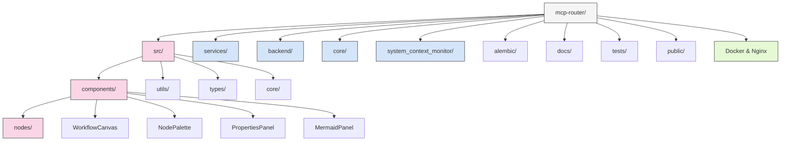
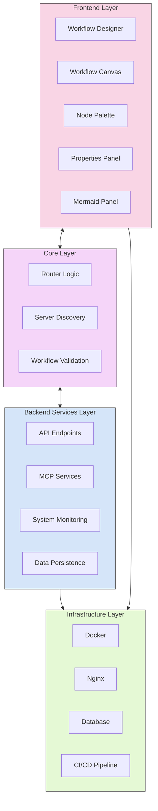
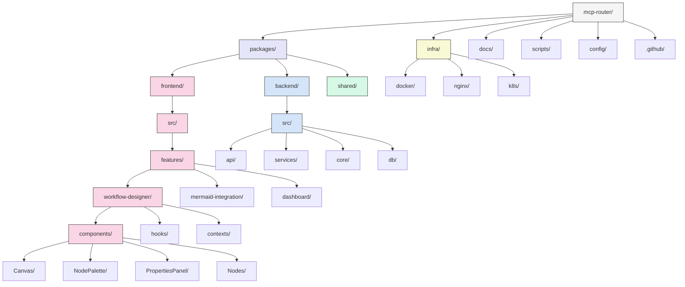
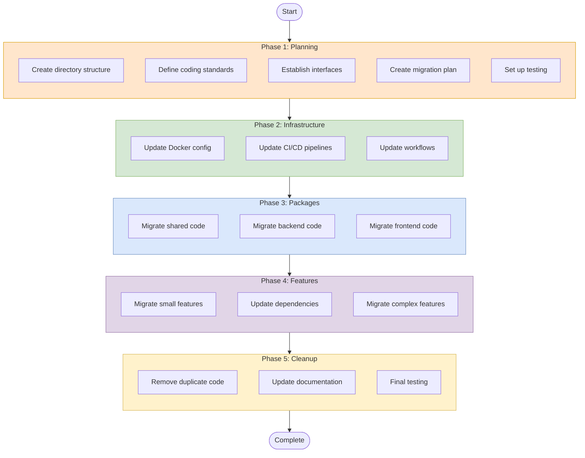

# MCP Router: Project Structure Analysis & Recommendations

## Table of Contents

1. [Current Structure](#current-structure)
2. [Architecture Overview](#architecture-overview)
3. [Recommended Structure](#recommended-structure)
4. [Migration Strategy](#migration-strategy)
5. [Implementation Script](#implementation-script)

## Current Structure

The MCP Router project currently has a complex structure with multiple overlapping directories and unclear boundaries.

### Key Issues:

- Inconsistent organization patterns
- Duplicate functionality across directories
- Unclear boundaries between `src/`, `frontend/`, `backend/`, `services/`, and `core/`
- Mixed development artifacts in repository
- Inconsistent naming conventions

## Architecture Overview

The MCP Router application consists of four main layers:

1. **Frontend Layer**: Visual workflow designer with node-based editing
2. **Core Layer**: Router functionality for MCP server communication
3. **Backend Services Layer**: API endpoints and system monitoring
4. **Infrastructure Layer**: Docker, Nginx, database, and CI/CD

## Recommended Structure

We recommend a monorepo structure with clear package boundaries:

1. **packages/**
   - **frontend/**: React application with feature-based organization
   - **backend/**: Backend services with clear API boundaries
   - **shared/**: Common code used by both frontend and backend

2. **infra/**: All infrastructure configuration
3. **docs/**: Project documentation
4. **scripts/**: Build and deployment scripts
5. **config/**: Project-wide configuration

### Key Benefits:

1. **Clear Package Boundaries**: Frontend, backend, and shared code separated
2. **Feature-Based Organization**: Frontend organized by features
3. **Consistent Structure**: Each package follows consistent patterns
4. **Infrastructure Separation**: Infrastructure code separate from application code
5. **Better Developer Experience**: Makes it easier to find and work with code

## Migration Strategy

We recommend a phased approach to migration:

1. **Phase 1: Planning**
   - Create directory structure
   - Define coding standards
   - Establish interfaces
   - Create migration plan
   - Set up testing

2. **Phase 2: Infrastructure**
   - Update Docker configuration
   - Update CI/CD pipelines
   - Update development workflows

3. **Phase 3: Packages**
   - Migrate shared code
   - Migrate backend code
   - Migrate frontend code

4. **Phase 4: Features**
   - Migrate small features first
   - Update dependencies
   - Migrate complex features

5. **Phase 5: Cleanup**
   - Remove duplicate code
   - Update documentation
   - Final testing

### Implementation Tips:

- Use Git branches to isolate changes
- Implement automated tests before changes
- Migrate gradually with thorough testing
- Update imports one pattern at a time
- Keep the team informed of progress

## Conclusion

This restructuring will make the codebase more maintainable, scalable, and easier for new team members to understand. The migration process should be gradual, focusing on one package or feature at a time, with thorough testing at each step.

#!/bin/bash

# MCP Router Restructuring Script
# This script implements the restructuring recommendations from the refactoring.md document

# Set variables
ROOT_DIR=$(pwd)
BACKUP_DIR="${ROOT_DIR}/backup_$(date +%Y%m%d_%H%M%S)"
DRY_RUN=false

# Parse command line arguments
while [[ "$#" -gt 0 ]]; do
    case $1 in
        --dry-run) DRY_RUN=true ;;
        *) echo "Unknown parameter: $1"; exit 1 ;;
    esac
    shift
done

# Print a message and exit if in dry run mode
execute() {
    if [ "$DRY_RUN" = true ]; then
        echo "[DRY RUN] Would execute: $1"
    else
        echo "Executing: $1"
        eval "$1"
        if [ $? -ne 0 ]; then
            echo "Error executing command: $1"
            exit 1
        fi
    fi
}

# Create backup
echo "Creating backup at ${BACKUP_DIR}..."
execute "mkdir -p \"${BACKUP_DIR}\""
execute "cp -r \"${ROOT_DIR}\"/* \"${BACKUP_DIR}/\""

echo "Starting restructuring..."

# Phase 1: Create the new directory structure
echo "Creating new directory structure..."
execute "mkdir -p \"${ROOT_DIR}/packages/frontend/src/features/workflow-designer/components/Canvas\""
execute "mkdir -p \"${ROOT_DIR}/packages/frontend/src/features/workflow-designer/components/NodePalette\""
execute "mkdir -p \"${ROOT_DIR}/packages/frontend/src/features/workflow-designer/components/PropertiesPanel\""
execute "mkdir -p \"${ROOT_DIR}/packages/frontend/src/features/workflow-designer/components/Nodes\""
execute "mkdir -p \"${ROOT_DIR}/packages/frontend/src/features/workflow-designer/contexts\""
execute "mkdir -p \"${ROOT_DIR}/packages/frontend/src/features/workflow-designer/hooks\""
execute "mkdir -p \"${ROOT_DIR}/packages/frontend/src/features/workflow-designer/utils\""
execute "mkdir -p \"${ROOT_DIR}/packages/frontend/src/features/workflow-designer/types\""
execute "mkdir -p \"${ROOT_DIR}/packages/frontend/src/features/mermaid-integration/components\""
execute "mkdir -p \"${ROOT_DIR}/packages/frontend/src/features/mermaid-integration/utils\""
execute "mkdir -p \"${ROOT_DIR}/packages/frontend/src/features/dashboard\""
execute "mkdir -p \"${ROOT_DIR}/packages/frontend/src/shared/components\""
execute "mkdir -p \"${ROOT_DIR}/packages/frontend/src/shared/hooks\""
execute "mkdir -p \"${ROOT_DIR}/packages/frontend/src/shared/utils\""
execute "mkdir -p \"${ROOT_DIR}/packages/frontend/src/shared/types\""
execute "mkdir -p \"${ROOT_DIR}/packages/frontend/src/app\""
execute "mkdir -p \"${ROOT_DIR}/packages/frontend/public\""
execute "mkdir -p \"${ROOT_DIR}/packages/frontend/tests/unit\""
execute "mkdir -p \"${ROOT_DIR}/packages/frontend/tests/integration\""
execute "mkdir -p \"${ROOT_DIR}/packages/frontend/tests/e2e\""
execute "mkdir -p \"${ROOT_DIR}/packages/frontend/config/webpack\""
execute "mkdir -p \"${ROOT_DIR}/packages/frontend/config/jest\""

execute "mkdir -p \"${ROOT_DIR}/packages/backend/src/api/controllers\""
execute "mkdir -p \"${ROOT_DIR}/packages/backend/src/api/middleware\""
execute "mkdir -p \"${ROOT_DIR}/packages/backend/src/api/routes\""
execute "mkdir -p \"${ROOT_DIR}/packages/backend/src/services/workflow\""
execute "mkdir -p \"${ROOT_DIR}/packages/backend/src/services/mcp\""
execute "mkdir -p \"${ROOT_DIR}/packages/backend/src/services/system-monitor\""
execute "mkdir -p \"${ROOT_DIR}/packages/backend/src/core/router\""
execute "mkdir -p \"${ROOT_DIR}/packages/backend/src/core/discovery\""
execute "mkdir -p \"${ROOT_DIR}/packages/backend/src/db/models\""
execute "mkdir -p \"${ROOT_DIR}/packages/backend/src/db/repositories\""
execute "mkdir -p \"${ROOT_DIR}/packages/backend/src/db/migrations\""
execute "mkdir -p \"${ROOT_DIR}/packages/backend/src/utils\""
execute "mkdir -p \"${ROOT_DIR}/packages/backend/tests/unit\""
execute "mkdir -p \"${ROOT_DIR}/packages/backend/tests/integration\""
execute "mkdir -p \"${ROOT_DIR}/packages/backend/config\""

execute "mkdir -p \"${ROOT_DIR}/packages/shared/src/types\""
execute "mkdir -p \"${ROOT_DIR}/packages/shared/src/utils\""
execute "mkdir -p \"${ROOT_DIR}/packages/shared/src/constants\""

execute "mkdir -p \"${ROOT_DIR}/infra/docker/frontend\""
execute "mkdir -p \"${ROOT_DIR}/infra/docker/backend\""
execute "mkdir -p \"${ROOT_DIR}/infra/nginx\""
execute "mkdir -p \"${ROOT_DIR}/infra/k8s\""
execute "mkdir -p \"${ROOT_DIR}/infra/scripts\""

execute "mkdir -p \"${ROOT_DIR}/docs/architecture\""
execute "mkdir -p \"${ROOT_DIR}/docs/api\""
execute "mkdir -p \"${ROOT_DIR}/docs/user-guides\""
execute "mkdir -p \"${ROOT_DIR}/docs/developer-guides\""

execute "mkdir -p \"${ROOT_DIR}/scripts\""
execute "mkdir -p \"${ROOT_DIR}/config\""

# Phase 2: Move files to their new locations
echo "Moving files to new locations..."

# Move frontend files
echo "Moving frontend files..."

# Move React components
if [ -d "${ROOT_DIR}/src/components" ]; then
    # Move WorkflowCanvas
    execute "mv \"${ROOT_DIR}/src/components/WorkflowCanvas.tsx\" \"${ROOT_DIR}/packages/frontend/src/features/workflow-designer/components/Canvas/index.tsx\" 2>/dev/null || true"
    
    # Move NodePalette
    execute "mv \"${ROOT_DIR}/src/components/NodePalette.tsx\" \"${ROOT_DIR}/packages/frontend/src/features/workflow-designer/components/NodePalette/index.tsx\" 2>/dev/null || true"
    
    # Move PropertiesPanel
    execute "mv \"${ROOT_DIR}/src/components/PropertiesPanel.tsx\" \"${ROOT_DIR}/packages/frontend/src/features/workflow-designer/components/PropertiesPanel/index.tsx\" 2>/dev/null || true"
    
    # Move MermaidPanel
    execute "mv \"${ROOT_DIR}/src/components/MermaidPanel.tsx\" \"${ROOT_DIR}/packages/frontend/src/features/mermaid-integration/components/MermaidPanel.tsx\" 2>/dev/null || true"
    
    # Move WorkflowDesigner
    execute "mv \"${ROOT_DIR}/src/components/WorkflowDesigner.tsx\" \"${ROOT_DIR}/packages/frontend/src/features/workflow-designer/index.tsx\" 2>/dev/null || true"
    
    # Move node components
    if [ -d "${ROOT_DIR}/src/components/nodes" ]; then
        for node in "${ROOT_DIR}"/src/components/nodes/*.tsx; do
            if [ -f "$node" ]; then
                node_name=$(basename "$node" .tsx)
                execute "mkdir -p \"${ROOT_DIR}/packages/frontend/src/features/workflow-designer/components/Nodes/${node_name}\""
                execute "mv \"$node\" \"${ROOT_DIR}/packages/frontend/src/features/workflow-designer/components/Nodes/${node_name}/index.tsx\" 2>/dev/null || true"
            fi
        done
    fi
fi

# Move utility files
if [ -d "${ROOT_DIR}/src/utils" ]; then
    # Move mermaid utilities
    if [ -d "${ROOT_DIR}/src/utils/mermaid" ]; then
        execute "mv \"${ROOT_DIR}/src/utils/mermaid\"/* \"${ROOT_DIR}/packages/frontend/src/features/mermaid-integration/utils/\" 2>/dev/null || true"
    fi
    
    # Move workflow validator
    execute "mv \"${ROOT_DIR}/src/utils/workflow-validator.ts\" \"${ROOT_DIR}/packages/frontend/src/features/workflow-designer/utils/\" 2>/dev/null || true"
    
    # Move other utilities to shared
    execute "find \"${ROOT_DIR}/src/utils\" -maxdepth 1 -type f -exec mv {} \"${ROOT_DIR}/packages/frontend/src/shared/utils/\" \\; 2>/dev/null || true"
fi

# Move types
if [ -d "${ROOT_DIR}/src/types" ]; then
    # Move agent types to frontend workflow designer
    execute "mv \"${ROOT_DIR}/src/types/agent-types.ts\" \"${ROOT_DIR}/packages/frontend/src/features/workflow-designer/types/\" 2>/dev/null || true"
    
    # Move router types to core
    execute "mv \"${ROOT_DIR}/src/types/router.ts\" \"${ROOT_DIR}/packages/backend/src/core/router/types.ts\" 2>/dev/null || true"
    
    # Move other types to shared
    execute "find \"${ROOT_DIR}/src/types\" -maxdepth 1 -type f -not -name \"agent-types.ts\" -not -name \"router.ts\" -exec mv {} \"${ROOT_DIR}/packages/shared/src/types/\" \\; 2>/dev/null || true"
fi

# Move core files
if [ -d "${ROOT_DIR}/src/core" ]; then
    # Move router
    execute "mv \"${ROOT_DIR}/src/core/router.ts\" \"${ROOT_DIR}/packages/backend/src/core/router/index.ts\" 2>/dev/null || true"
    
    # Move discovery
    execute "mv \"${ROOT_DIR}/src/core/discovery.ts\" \"${ROOT_DIR}/packages/backend/src/core/discovery/index.ts\" 2>/dev/null || true"
    
    # Move other core files
    execute "find \"${ROOT_DIR}/src/core\" -maxdepth 1 -type f -not -name \"router.ts\" -not -name \"discovery.ts\" -exec mv {} \"${ROOT_DIR}/packages/backend/src/core/\" \\; 2>/dev/null || true"
fi

# Move App and index
execute "mv \"${ROOT_DIR}/src/App.tsx\" \"${ROOT_DIR}/packages/frontend/src/app/App.tsx\" 2>/dev/null || true"
execute "mv \"${ROOT_DIR}/src/index.tsx\" \"${ROOT_DIR}/packages/frontend/src/app/index.tsx\" 2>/dev/null || true"
execute "mv \"${ROOT_DIR}/src/index.css\" \"${ROOT_DIR}/packages/frontend/src/app/styles/global.css\" 2>/dev/null || true"

# Move public files
execute "mv \"${ROOT_DIR}/public\"/* \"${ROOT_DIR}/packages/frontend/public/\" 2>/dev/null || true"

# Move backend files
echo "Moving backend files..."

# Move services
if [ -d "${ROOT_DIR}/services" ]; then
    execute "find \"${ROOT_DIR}/services\" -type f -exec cp --parents {} \"${ROOT_DIR}/packages/backend/\" \\; 2>/dev/null || true"
fi

# Move system context monitor
if [ -d "${ROOT_DIR}/system_context_monitor" ]; then
    execute "mv \"${ROOT_DIR}/system_context_monitor\" \"${ROOT_DIR}/packages/backend/src/services/system-monitor\" 2>/dev/null || true"
fi

# Move backend directory
if [ -d "${ROOT_DIR}/backend" ]; then
    execute "find \"${ROOT_DIR}/backend\" -type f -exec cp --parents {} \"${ROOT_DIR}/packages/backend/\" \\; 2>/dev/null || true"
fi

# Move alembic migrations
if [ -d "${ROOT_DIR}/alembic" ]; then
    execute "mv \"${ROOT_DIR}/alembic\" \"${ROOT_DIR}/packages/backend/src/db/migrations/alembic\" 2>/dev/null || true"
    execute "mv \"${ROOT_DIR}/alembic.ini\" \"${ROOT_DIR}/packages/backend/src/db/migrations/\" 2>/dev/null || true"
fi

# Move infrastructure files
echo "Moving infrastructure files..."

# Move Dockerfiles
execute "mv \"${ROOT_DIR}/Dockerfile\" \"${ROOT_DIR}/infra/docker/Dockerfile\" 2>/dev/null || true"
execute "mv \"${ROOT_DIR}/Dockerfile.backend\" \"${ROOT_DIR}/infra/docker/backend/Dockerfile\" 2>/dev/null || true"

# Move docker-compose
execute "mv \"${ROOT_DIR}/docker-compose.yml\" \"${ROOT_DIR}/infra/docker/docker-compose.yml\" 2>/dev/null || true"

# Move nginx config
if [ -d "${ROOT_DIR}/nginx" ]; then
    execute "mv \"${ROOT_DIR}/nginx\"/* \"${ROOT_DIR}/infra/nginx/\" 2>/dev/null || true"
fi

# Move GitHub workflows
if [ -d "${ROOT_DIR}/.github" ]; then
    execute "mv \"${ROOT_DIR}/.github\" \"${ROOT_DIR}/.github\" 2>/dev/null || true"
fi

# Move scripts
execute "mv \"${ROOT_DIR}/start.sh\" \"${ROOT_DIR}/scripts/start.sh\" 2>/dev/null || true"
execute "mv \"${ROOT_DIR}/dev.sh\" \"${ROOT_DIR}/scripts/dev.sh\" 2>/dev/null || true"
execute "find \"${ROOT_DIR}\" -maxdepth 1 -name \"*.sh\" -not -name \"start.sh\" -not -name \"dev.sh\" -exec mv {} \"${ROOT_DIR}/scripts/\" \\; 2>/dev/null || true"

# Move docs
execute "mv \"${ROOT_DIR}/docs\"/* \"${ROOT_DIR}/docs/\" 2>/dev/null || true"

# Move tests
if [ -d "${ROOT_DIR}/tests" ]; then
    # Determine if these are frontend or backend tests and move accordingly
    if grep -q "react" "${ROOT_DIR}/tests"/*; then
        execute "find \"${ROOT_DIR}/tests\" -type f -exec cp --parents {} \"${ROOT_DIR}/packages/frontend/\" \\; 2>/dev/null || true"
    else
        execute "find \"${ROOT_DIR}/tests\" -type f -exec cp --parents {} \"${ROOT_DIR}/packages/backend/\" \\; 2>/dev/null || true"
    fi
fi

# Create package configuration files
echo "Creating package configuration files..."

# Frontend package.json
execute "touch \"${ROOT_DIR}/packages/frontend/package.json\""
execute "cat > \"${ROOT_DIR}/packages/frontend/package.json\" << EOF
{
  \"name\": \"mcp-router-frontend\",
  \"version\": \"0.1.0\",
  \"private\": true,
  \"dependencies\": {
    \"react\": \"^18.2.0\",
    \"react-dom\": \"^18.2.0\"
  }
}
EOF"

# Backend package.json or requirements.txt
execute "touch \"${ROOT_DIR}/packages/backend/requirements.txt\""
execute "cat > \"${ROOT_DIR}/packages/backend/requirements.txt\" << EOF
fastapi==0.95.0
uvicorn==0.21.1
sqlalchemy==2.0.7
alembic==1.10.2
pydantic==1.10.7
EOF"

# Shared package.json
execute "touch \"${ROOT_DIR}/packages/shared/package.json\""
execute "cat > \"${ROOT_DIR}/packages/shared/package.json\" << EOF
{
  \"name\": \"mcp-router-shared\",
  \"version\": \"0.1.0\",
  \"private\": true
}
EOF"

# Root package.json
execute "touch \"${ROOT_DIR}/package.json\""
execute "cat > \"${ROOT_DIR}/package.json\" << EOF
{
  \"name\": \"mcp-router\",
  \"version\": \"0.1.0\",
  \"private\": true,
  \"workspaces\": [
    \"packages/*\"
  ]
}
EOF"

echo "Restructuring complete!"
echo "Original files backed up to ${BACKUP_DIR}"
echo "You may need to update import paths in your code to reflect the new structure."