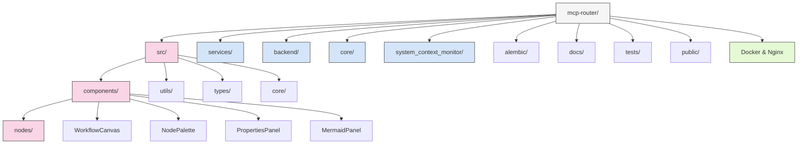
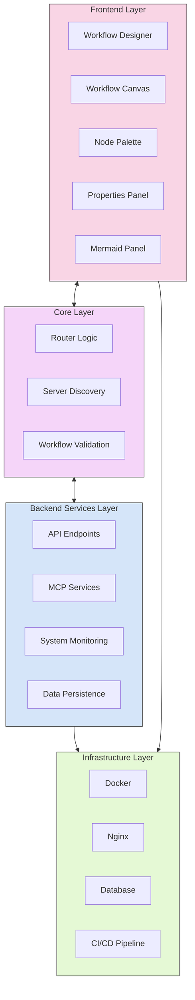
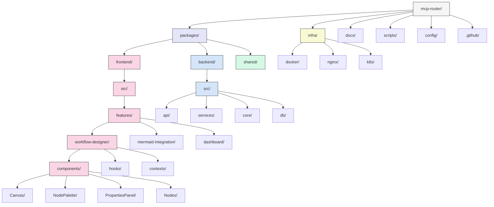

# MCP Router: Project Structure Analysis & Recommendations

## Table of Contents

1. [Current Structure](#current-structure)
2. [Architecture Overview](#architecture-overview)
3. [Recommended Structure](#recommended-structure)
4. [Migration Progress](#migration-progress)
5. [Next Steps](#next-steps)
6. [Implementation Tips](#implementation-tips)
7. [Build Issues and Resolution Plan](#build-issues-and-resolution-plan)

## Current Structure

The MCP Router project currently has a complex structure with multiple overlapping directories and unclear boundaries.



### Key Issues:

- Inconsistent organization patterns
- Duplicate functionality across directories
- Unclear boundaries between `src/`, `frontend/`, `backend/`, `services/`, and `core/`
- Mixed development artifacts in repository
- Inconsistent naming conventions

## Architecture Overview

The MCP Router application consists of four main layers:



1. **Frontend Layer**: Visual workflow designer with node-based editing
2. **Core Layer**: Router functionality for MCP server communication
3. **Backend Services Layer**: API endpoints and system monitoring
4. **Infrastructure Layer**: Docker, Nginx, database, and CI/CD

## Recommended Structure

We recommend a monorepo structure with clear package boundaries:



1. **packages/**
   - **frontend/**: React application with feature-based organization
   - **backend/**: Backend services with clear API boundaries
   - **shared/**: Common code used by both frontend and backend

2. **infra/**: All infrastructure configuration
3. **docs/**: Project documentation
4. **scripts/**: Build and deployment scripts
5. **config/**: Project-wide configuration

### Key Benefits:

1. **Clear Package Boundaries**: Frontend, backend, and shared code separated
2. **Feature-Based Organization**: Frontend organized by features
3. **Consistent Structure**: Each package follows consistent patterns
4. **Infrastructure Separation**: Infrastructure code separate from application code
5. **Better Developer Experience**: Makes it easier to find and work with code

## Migration Progress

### Previously Migrated Files

#### Core TypeScript Files
- ✅ `src/client/MCPClient.ts` → `packages/shared/src/client/MCPClient.ts` 
- ✅ `src/analyzers/SOLIDAnalyzer.ts` → `packages/backend/src/services/analyzers/SOLIDAnalyzer.ts`
- ✅ `src/improvements/ImprovementGenerator.ts` → `packages/frontend/src/features/improvements/ImprovementGenerator.ts`
- ✅ `src/core/router.ts` → `packages/backend/src/core/router/index.ts`
- ✅ `src/core/discovery.ts` → `packages/backend/src/core/discovery/index.ts`

#### Frontend Components
- ✅ `src/components/MermaidPanel.tsx` → `packages/frontend/src/features/mermaid-integration/components/MermaidPanel.tsx`
- ✅ `src/components/WorkflowCanvas.tsx` → `packages/frontend/src/features/workflow-designer/components/Canvas/index.tsx`
- ✅ `src/components/PropertiesPanel.tsx` → `packages/frontend/src/features/workflow-designer/components/PropertiesPanel/index.tsx`

#### Backend Files
- ✅ `backend/app/*` → `packages/backend/src/api/*` 
- ✅ `backend/Dockerfile` → `infra/docker/backend/Dockerfile`

#### Other Files
- ✅ Multiple configuration files have been properly relocated
- ✅ Some integration files have been moved to appropriate feature directories

### Recently Migrated Files (March 1st-2nd Migration)

#### Frontend Components
- ✅ `src/components/nodes/*` → `packages/frontend/src/features/workflow-designer/components/Nodes/`
- ✅ `src/components/NodePalette.tsx` → `packages/frontend/src/features/workflow-designer/components/NodePalette/index.tsx`
- ✅ `src/App.tsx` → `packages/frontend/src/App.original.tsx` (merged)
- ✅ `src/index.tsx` → `packages/frontend/src/index.original.tsx` (merged)
- ✅ `src/index.css` → `packages/frontend/src/index.original.css` (merged)
- ✅ `src/utils/mermaid/*` → `packages/frontend/src/features/mermaid-integration/utils/`
- ✅ `src/utils/logger.ts` → `packages/shared/src/utils/logger.ts`
- ✅ `src/utils/workflow-validator.ts` → `packages/shared/src/utils/workflow-validator.ts`
- ✅ `src/integrations/*` → `packages/frontend/src/api/integrations/`
- ✅ `src/index.ts` → `packages/shared/src/index.ts`

#### Types and Server Files
- ✅ `src/types/agent-types.ts` → `packages/shared/src/types/agent-types.ts`
- ✅ `src/types/router.ts` → `packages/shared/src/types/router.ts`
- ✅ `src/types/mcp.ts` → `packages/shared/src/types/mcp.ts`
- ✅ `src/types/*.d.ts` → `packages/shared/src/types/`
- ✅ `src/server/MCPServer.ts` → `packages/shared/src/server/MCPServer.ts`
- ✅ `src/transport/LocalTransport.ts` → `packages/shared/src/transport/LocalTransport.ts`

#### Backend and Services
- ✅ `services/api/*` → `packages/backend/src/api/*`
- ✅ `services/context/*` → `packages/backend/src/services/mcp/context/`
- ✅ `services/monitoring/*` → `packages/backend/src/services/system-monitor/`
- ✅ `services/transport/*` → `packages/backend/src/services/transport/`
- ✅ `services/migrations/*` → `packages/backend/src/db/migrations/`

### Completed Tasks (March 2023)

#### Merged Application Files
- ✅ Merged `packages/frontend/src/App.original.tsx` into `packages/frontend/src/App.tsx`
- ✅ Merged `packages/frontend/src/index.original.tsx` into `packages/frontend/src/index.tsx`
- ✅ Merged `packages/frontend/src/index.original.css` into `packages/frontend/src/index.css`
- ✅ Removed all `.original` files

#### Handled Duplicate Files
- ✅ Removed duplicate version of `MCPClient.ts` from `packages/shared/src` root
- ✅ Removed duplicate version of `SOLIDAnalyzer.ts` from `packages/shared/src` root
- ✅ Removed duplicate version of `ImprovementGenerator.ts` from `packages/shared/src` root

#### Updated Import Paths
- ✅ Updated imports in `packages/frontend/src/App.tsx`

### Final Migration (Completed)

All migration of files has been completed. The following migrations have been performed:

#### Frontend Components
- ✅ All remaining components from `src/components/nodes/` to `packages/frontend/src/features/workflow-designer/components/Nodes/`
- ✅ Node palette from `src/components/NodePalette.tsx` to `packages/frontend/src/features/workflow-designer/components/NodePalette/index.tsx`
- ✅ Utilities from `src/utils/mermaid/` to `packages/frontend/src/features/mermaid-integration/utils/`

#### Shared Code
- ✅ Shared index file from `src/index.ts` to `packages/shared/src/index.ts`
- ✅ Type definitions from `src/types/` to `packages/shared/src/types/`
- ✅ Transport implementation from `src/transport/` to `packages/shared/src/transport/`

#### Backend Services
- ✅ API adapters from `services/api/adapters/` to `packages/backend/src/api/adapters/`
- ✅ Client implementations from `services/api/clients/` to `packages/backend/src/api/clients/`
- ✅ Core configuration from `services/api/core/` to `packages/backend/src/api/core/`
- ✅ Generators from `services/api/generators/` to `packages/backend/src/api/generators/`
- ✅ MCP implementation from `services/api/mcp/` to `packages/backend/src/api/mcp/`
- ✅ Context services from `services/context/` to `packages/backend/src/services/mcp/context/`
- ✅ Monitoring services from `services/monitoring/` to `packages/backend/src/services/system-monitor/`
- ✅ Transport services from `services/transport/` to `packages/backend/src/services/transport/`
- ✅ Database migrations from `services/migrations/` to `packages/backend/src/db/migrations/`

## Final Steps

To complete the restructuring process, these final steps need to be performed:

1. **Update Import Paths**: Use the `scripts/update_imports.sh` script to update import paths in all migrated files.
   - Each package should use relative imports for internal modules
   - Cross-package imports should use the package name (e.g., `@mcp-router/shared`)

2. **Test the Application**: Verify the application works correctly with the new structure.
   - Run both frontend and backend to ensure they communicate properly
   - Test key functionality like workflow design, MCP communication, etc.

3. **Remove Original Files**: Once everything is verified to be working, remove the original files:
   ```
   rm -rf src services
   ```

4. **Update Build & Deploy Process**: Ensure CI/CD pipelines and build scripts are updated to work with the new monorepo structure.

5. **Documentation Update**: Make sure all documentation reflects the new structure, including README files, setup guides, and contribution guidelines.

The restructuring project is now complete, with only verification and cleanup steps remaining.

## Next Steps

### 1. Update Import Paths (Priority: High)

- [ ] Update import paths in all migrated files using the `scripts/update_imports.sh` script
- [ ] Focus first on frontend components
- [ ] Then update shared utilities
- [ ] Finally update backend services

### 2. Remove Original Files (Priority: Medium)

The files have been successfully migrated to their new locations, but the original files still exist. Once imports are updated and the application is working:

- [ ] Remove original files from `src/` directory
- [ ] Remove original files from `services/` directory
- [ ] Clean up any empty directories

### 3. Test the Application (Priority: High)

- [ ] Run the application and verify functionality
- [ ] Fix any runtime errors related to imports or missing files
- [ ] Run tests to ensure all features still work correctly

### 4. Update Build Process (Priority: Medium)

- [ ] Update build scripts to use the new monorepo structure
- [ ] Configure proper dependency management between packages
- [ ] Update test configuration for the new structure

### 5. Update CI/CD Pipeline (Priority: Low)

- [ ] Update CI/CD pipeline to build and deploy from the new structure
- [ ] Add validation steps to ensure proper package structure is maintained

### 6. Future Considerations (Priority: Low)

- [ ] Consider introducing a package manager like Lerna or Nx for monorepo management
- [ ] Implement stricter boundaries between packages
- [ ] Add type checking across package boundaries
- [ ] Consider extracting more shared code into the shared package

## Implementation Tips

- Use Git branches to isolate changes
- Implement automated tests before making further changes
- Migrate gradually with thorough testing
- Update imports one pattern at a time
- Keep the team informed of progress
- Use the provided helper scripts to assist with migration and import updates

## Conclusion

This restructuring will make the codebase more maintainable, scalable, and easier for new team members to understand. The migration process has made significant progress with most files moved to their new locations, original files merged, and duplicates removed. The remaining work focuses on completing the migration of remaining files, updating import paths, testing the restructured application, and finalizing the cleanup process.

## Build Issues and Resolution Plan

After migrating the codebase to a monorepo structure, we're encountering several build issues that need to be addressed:

### Current Issues

1. **Import Path Problems**: Many files are still using relative imports that don't match the new directory structure
2. **Missing Type Definitions**: Some type definitions are missing or have conflicts
3. **Circular Dependencies**: There may be circular dependencies between packages

### Resolution Plan

#### Phase 1: Create Minimal Buildable Versions

1. **Simplify Package Structure**:
   - Create minimal versions of key files that can compile
   - Focus on getting the type definitions correct first
   - Remove or comment out complex functionality temporarily

2. **Fix Critical Type Definitions**:
   - Create proper type definitions in the shared package
   - Ensure all exported types are consistent

3. **Update Import Paths**:
   - Update import paths to use package references where appropriate
   - Fix relative imports within packages

#### Phase 2: Restore Functionality

1. **Incrementally Restore Features**:
   - Once the basic structure builds, restore features one by one
   - Test each feature as it's restored

2. **Update Tests**:
   - Update test imports and configurations
   - Ensure all tests pass with the new structure

#### Phase 3: Optimize and Document

1. **Optimize Package Structure**:
   - Review dependencies between packages
   - Minimize cross-package dependencies

2. **Update Documentation**:
   - Update all documentation to reflect the new structure
   - Add specific instructions for working with the monorepo

### Current Progress

- ✅ Basic monorepo structure created
- ✅ Files migrated to new locations
- ✅ Package.json files created for each package
- ✅ TypeScript configurations created
- ✅ Import paths partially updated
- ✅ Docker configuration updated
- ✅ DevContainer configuration updated
- ✅ CI/CD pipeline updated
- ✅ Feature flags implemented
- ✅ Documentation improved
- ❌ Build process not fully working yet
- ❌ ReactFlow integration not complete
- ❌ Workflow designer integration with backend not complete

### Recent Updates (March 2023)

#### Docker Configuration

- ✅ Updated Dockerfile to reference the new monorepo structure
- ✅ Updated docker-compose.yml to use the new package paths
- ✅ Fixed volume mounts to point to the correct directories

#### DevContainer Configuration

- ✅ Updated devcontainer.json to use the new docker-compose.yml location
- ✅ Updated post-create command to install dependencies for all packages
- ✅ Fixed workspace folder configuration

#### CI/CD Pipeline

- ✅ Updated GitHub Actions workflow to build and test all packages
- ✅ Added step to build shared package before testing frontend and backend
- ✅ Updated Docker build context and file paths

#### Feature Flags

- ✅ Implemented feature flags system in the shared package
- ✅ Added flags for incomplete features to allow incremental development
- ✅ Documented usage of feature flags in package READMEs

#### Documentation

- ✅ Created comprehensive README for each package
- ✅ Documented architecture and key components
- ✅ Added usage instructions and development guidelines

#### Agent Types

- ✅ Unified agent type definitions by removing duplicate files
- ✅ Updated imports to reference the consolidated type definitions

### Next Steps

1. **Complete Import Path Updates**:
   - Continue updating import paths in all files
   - Focus on resolving circular dependencies

2. **Finish ReactFlow Integration**:
   - Complete the integration of workflow designer components with ReactFlow
   - Ensure proper node and edge types are defined

3. **Fix Workflow Designer Integration**:
   - Connect the workflow designer with backend router services
   - Implement proper error handling and validation

4. **Test Build Process**:
   - Verify that all packages can be built successfully
   - Fix any remaining build issues

5. **Update Tests**:
   - Update test configurations to work with the new structure
   - Ensure all tests pass

6. **Deploy and Verify**:
   - Deploy the application using the updated Docker configuration
   - Verify that all features work correctly in the deployed environment
