# System Integration Architecture

This document provides a comprehensive view of how Python, TypeScript, and React components integrate within the System Context Monitor.

## Table of Contents
1. [Full Stack Integration Overview](#full-stack-integration-overview)
2. [TypeScript-Python Data Flow](#typescript-python-data-flow)
3. [Component Type Integration](#component-type-integration)
4. [Real-time Monitoring Flow](#real-time-monitoring-flow)
5. [API Integration Architecture](#api-integration-architecture)

## Full Stack Integration Overview

This diagram shows the complete system architecture with color-coded layers for each technology:
- 🟢 Green: React Components (UI Layer)
- 🔵 Blue: TypeScript Logic
- 🔴 Red: Python Backend Services
- 🟣 Purple: Infrastructure Components

```mermaid
%%{
  init: {
    'theme': 'base',
    'themeVariables': {
      'primaryColor': '#e74c3c',
      'secondaryColor': '#3498db',
      'tertiaryColor': '#2ecc71',
      'mainBkg': '#ffffff',
      'nodeBorder': '#2c3e50',
      'clusterBkg': '#f8f9fa',
      'clusterBorder': '#dee2e6',
      'lineColor': '#2c3e50',
      'fontFamily': 'Arial',
      'fontSize': '14px'
    }
  }
}%%
graph TB
    %% Node Styling
    classDef reactComponent fill:#2ecc71,stroke:#27ae60,color:white,stroke-width:2px,rx:5px;
    classDef tsLogic fill:#3498db,stroke:#2980b9,color:white,stroke-width:2px,rx:5px;
    classDef pythonService fill:#e74c3c,stroke:#c0392b,color:white,stroke-width:2px,rx:5px;
    classDef infrastructure fill:#9b59b6,stroke:#8e44ad,color:white,stroke-width:2px,rx:5px;
    
    %% Frontend Layer
    subgraph Frontend["🖥️ Frontend Layer"]
        style Frontend fill:#f8f9fa,stroke:#dee2e6,stroke-width:2px
        
        subgraph ReactComponents["React Components"]
            Dashboard["📊 Dashboard"]
            MonitoringPanel["📈 MonitoringPanel"]
            ContextViewer["👁️ ContextViewer"]
        end
        
        subgraph TSLogic["TypeScript Logic"]
            StateManager["⚙️ State Manager"]
            WebSocketClient["🔌 WebSocket Client"]
            APIClient["🌐 API Client"]
        end
    end
    
    %% Backend Layer
    subgraph Backend["⚡ Backend Layer"]
        style Backend fill:#f8f9fa,stroke:#dee2e6,stroke-width:2px
        
        subgraph Services["Python Services"]
            MonitoringService["📡 Monitoring Service"]
            ContextService["💾 Context Service"]
            WebSocketManager["🔄 WebSocket Manager"]
        end
        
        subgraph DataLayer["Data Layer"]
            Redis["📦 Redis Cache"]
            PostgreSQL["🗄️ PostgreSQL"]
            MessageQueue["📨 Message Queue"]
        end
    end
    
    %% Connections with improved styling
    Dashboard --> |"uses"| StateManager
    MonitoringPanel --> |"uses"| StateManager
    ContextViewer --> |"uses"| StateManager
    
    StateManager --> |"connects"| WebSocketClient
    StateManager --> |"calls"| APIClient
    
    WebSocketClient --> |"communicates"| WebSocketManager
    APIClient --> |"requests"| MonitoringService
    APIClient --> |"requests"| ContextService
    
    MonitoringService --> |"caches"| Redis
    ContextService --> |"caches"| Redis
    MonitoringService --> |"stores"| PostgreSQL
    ContextService --> |"stores"| PostgreSQL
    WebSocketManager --> |"publishes"| MessageQueue
    
    %% Apply styles
    class Dashboard,MonitoringPanel,ContextViewer reactComponent;
    class StateManager,WebSocketClient,APIClient tsLogic;
    class MonitoringService,ContextService,WebSocketManager pythonService;
    class Redis,PostgreSQL,MessageQueue infrastructure;

    %% Link styling
    linkStyle default stroke-width:2px,fill:none;
```

## TypeScript-Python Data Flow

```mermaid
%%{
  init: {
    'theme': 'base',
    'themeVariables': {
      'primaryColor': '#3498db',
      'secondaryColor': '#e74c3c',
      'tertiaryColor': '#2ecc71',
      'mainBkg': '#ffffff',
      'nodeBorder': '#2c3e50',
      'sequenceNumberColor': '#2c3e50',
      'actorBorder': '#2c3e50',
      'actorBkg': '#f8f9fa',
      'noteBkg': '#f8f9fa',
      'noteBorder': '#dee2e6',
      'messageFontWeight': 'bold',
      'messageFontFamily': 'Arial'
    }
  }
}%%
sequenceDiagram
    participant RC as 🖥️ React<br/>Component
    participant TS as 🔷 TypeScript<br/>Logic
    participant WS as 🔌 WebSocket<br/>Transport
    participant PY as 🔴 Python<br/>Backend
    participant DB as 💾 Database
    
    note over RC: UI Events
    RC->>+TS: 🖱️ User Action
    activate TS
    TS->>+WS: 📤 Send Event
    activate WS
    WS->>+PY: 🔄 Process Event
    activate PY
    PY->>+DB: 💾 Store Data
    activate DB
    DB-->>-PY: ✅ Confirm Storage
    deactivate DB
    
    note over PY: Process Update
    PY->>-WS: 📡 Broadcast Update
    deactivate PY
    WS->>-TS: 📥 Process Update
    deactivate WS
    TS->>-RC: 🔄 Update UI
    deactivate TS
    
    note over RC,DB: Complete Flow Cycle
```

## Component Type Integration

```mermaid
%%{
  init: {
    'theme': 'base',
    'themeVariables': {
      'primaryColor': '#3498db',
      'secondaryColor': '#e74c3c',
      'tertiaryColor': '#2ecc71',
      'mainBkg': '#ffffff',
      'classBorder': '#2c3e50',
      'classText': '#2c3e50',
      'relationLineColor': '#2c3e50',
      'lineWidth': '2px'
    }
  }
}%%
classDiagram
    %% Class styling
    class ReactComponent {
        <<React>>
        +render(): JSX.Element
        +useEffect(): void
        +useState~T~(): [T, (T)=>void]
        #handleEvent(e: Event): void
        -updateState(): void
    }
    
    class TypeScriptService {
        <<TypeScript>>
        +connect(): Promise~void~
        +send(msg: Message): Promise~void~
        +onMessage(handler: Handler): void
        #validateMessage(msg: Message): boolean
        -handleError(error: Error): void
    }
    
    class PythonService {
        <<Python>>
        +process(): Coroutine
        +broadcast(): Coroutine
        +handle_error(): Coroutine
        #validate_data(): bool
        -log_error(): None
    }
    
    class SharedInterface {
        <<Interface>>
        +MessageType: enum
        +EventType: enum
        +StatusType: enum
        +validate(): boolean
        #transform(): void
    }
    
    %% Relationships with improved styling
    ReactComponent --|> TypeScriptService : uses
    TypeScriptService --|> SharedInterface : implements
    PythonService --|> SharedInterface : implements
    
    %% Notes with icons
    note for ReactComponent "🖥️ UI Components"
    note for TypeScriptService "🔷 Business Logic"
    note for PythonService "🔴 Backend Services"
    note for SharedInterface "🔄 Shared Contract"
```

## Real-time Monitoring Flow

```mermaid
%%{
  init: {
    'theme': 'base',
    'themeVariables': {
      'primaryColor': '#3498db',
      'secondaryColor': '#e74c3c',
      'tertiaryColor': '#2ecc71',
      'mainBkg': '#ffffff',
      'nodeBorder': '#2c3e50',
      'clusterBkg': '#f8f9fa',
      'clusterBorder': '#dee2e6',
      'lineWidth': '2px'
    }
  }
}%%
graph LR
    %% Node styling with rounded corners
    classDef uiComponent fill:#2ecc71,stroke:#27ae60,color:white,stroke-width:2px,rx:5px;
    classDef tsService fill:#3498db,stroke:#2980b9,color:white,stroke-width:2px,rx:5px;
    classDef pyService fill:#e74c3c,stroke:#c0392b,color:white,stroke-width:2px,rx:5px;
    
    subgraph UI["🖥️ React UI Layer"]
        Monitor["📊 MonitoringPanel"]
        Display["📈 MetricsDisplay"]
        Chart["📉 ChartComponent"]
    end
    
    subgraph TS["🔷 TypeScript Layer"]
        WSClient["🔌 WebSocket Client"]
        MetricsStore["💾 Metrics Store"]
        DataTransform["🔄 Data Transformer"]
    end
    
    subgraph PY["🔴 Python Layer"]
        MonitorSvc["📡 Monitoring Service"]
        MetricsCollector["📥 Metrics Collector"]
        DataProcessor["⚙️ Data Processor"]
    end
    
    %% Connections with descriptive labels
    Monitor --> |"subscribes"| WSClient
    Display --> |"reads"| MetricsStore
    Chart --> |"uses"| DataTransform
    
    WSClient --> |"streams"| MonitorSvc
    MetricsStore --> |"feeds"| DataTransform
    
    MonitorSvc --> |"collects"| MetricsCollector
    MetricsCollector --> |"processes"| DataProcessor
    DataProcessor --> |"updates"| WSClient
    
    %% Apply styles
    class Monitor,Display,Chart uiComponent;
    class WSClient,MetricsStore,DataTransform tsService;
    class MonitorSvc,MetricsCollector,DataProcessor pyService;

    %% Link styling
    linkStyle default stroke-width:2px,fill:none;
```

## API Integration Architecture

```mermaid
%%{
  init: {
    'theme': 'base',
    'themeVariables': {
      'primaryColor': '#3498db',
      'secondaryColor': '#e74c3c',
      'tertiaryColor': '#2ecc71',
      'mainBkg': '#ffffff',
      'nodeBorder': '#2c3e50',
      'clusterBkg': '#f8f9fa',
      'clusterBorder': '#dee2e6',
      'lineWidth': '2px'
    }
  }
}%%
graph TB
    %% Node styling with rounded corners
    classDef tsComponent fill:#3498db,stroke:#2980b9,color:white,stroke-width:2px,rx:5px;
    classDef transport fill:#9b59b6,stroke:#8e44ad,color:white,stroke-width:2px,rx:5px;
    classDef pyComponent fill:#e74c3c,stroke:#c0392b,color:white,stroke-width:2px,rx:5px;
    classDef reactComponent fill:#2ecc71,stroke:#27ae60,color:white,stroke-width:2px,rx:5px;
    
    subgraph TSLayer["🔷 TypeScript API Layer"]
        APIClient["🌐 API Client"]
        TypeDefs["📝 Type Definitions"]
        Validators["✅ Request Validators"]
    end
    
    subgraph Transport["🔄 Transport Layer"]
        REST["📡 REST Endpoints"]
        WS["🔌 WebSocket"]
        Events["📨 Event Bus"]
    end
    
    subgraph PYLayer["🔴 Python API Layer"]
        FastAPI["⚡ FastAPI Router"]
        Pydantic["📋 Pydantic Models"]
        Middleware["🔒 API Middleware"]
    end
    
    subgraph ReactLayer["🖥️ React Layer"]
        Dashboard["📊 Dashboard"]
        Settings["⚙️ Settings"]
        Admin["👤 Admin Panel"]
    end
    
    %% Connections with descriptive labels
    Dashboard --> |"calls"| APIClient
    Settings --> |"calls"| APIClient
    Admin --> |"calls"| APIClient
    
    APIClient --> |"uses"| TypeDefs
    APIClient --> |"validates"| Validators
    
    TypeDefs --> |"defines"| REST
    Validators --> |"validates"| REST
    
    REST --> |"routes to"| FastAPI
    WS --> |"connects to"| FastAPI
    Events --> |"processed by"| Middleware
    
    FastAPI --> |"validates with"| Pydantic
    Middleware --> |"uses"| Pydantic
    
    %% Apply styles
    class APIClient,TypeDefs,Validators tsComponent;
    class REST,WS,Events transport;
    class FastAPI,Pydantic,Middleware pyComponent;
    class Dashboard,Settings,Admin reactComponent;

    %% Link styling
    linkStyle default stroke-width:2px,fill:none;
```

## Color Legend

Throughout these diagrams, we use a consistent color scheme to identify different technology layers:

- 🟢 **Green (#2ecc71)**: React Components and UI Layer
- 🔵 **Blue (#3498db)**: TypeScript Services and Logic
- 🔴 **Red (#e74c3c)**: Python Backend Services
- 🟣 **Purple (#9b59b6)**: Shared Infrastructure Components

Each diagram has been enhanced with:
- Consistent styling and theming
- Clear visual hierarchy
- Descriptive labels and icons
- Improved readability
- Better component organization
- Rounded corners for nodes
- Proper activation/deactivation in sequence diagrams
- Consistent line weights and styles
- Improved subgraph organization 