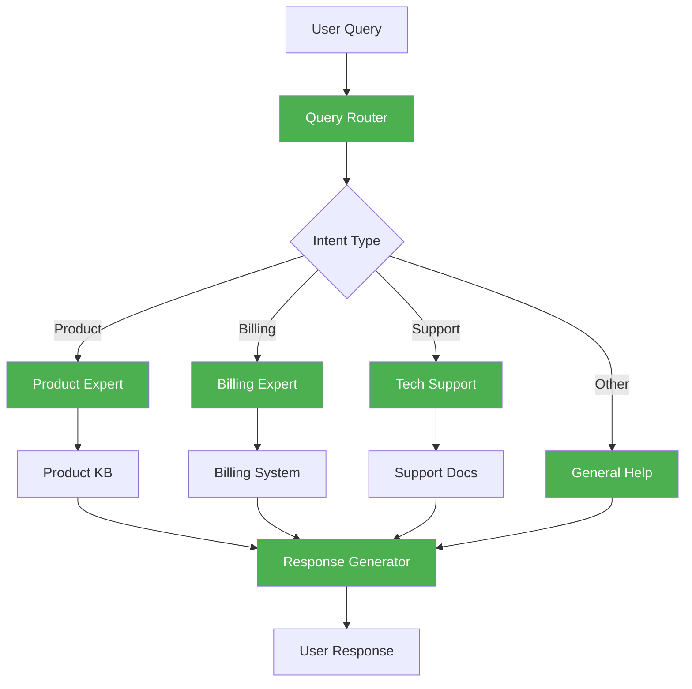

# LLM Agent Workflow Designer

## Overview

The LLM Agent Workflow Designer is a visual interface for creating, testing, and deploying agent systems using large language models. It integrates Anthropic's agent design patterns with Model Context Protocol (MCP) servers to enable powerful, composable AI workflows.

## Core Architecture

```mermaid
graph TD
    Designer[Workflow Designer] --> Core[Core Components]
    Designer --> Patterns[Agent Patterns]
    Designer --> MCP[MCP Integration]
    
    subgraph "Core Components"
        Canvas[Visual Canvas]
        Library[Template Library]
        Testing[Testing Framework]
        Mermaid[Mermaid Generation]
        Deploy[Deployment Tools]
    end
    
    Core --> Canvas
    Core --> Library
    Core --> Testing
    Core --> Mermaid
    Core --> Deploy
    
    subgraph "Agent Patterns"
        PC[Prompt Chaining]
        RT[Routing]
        PA[Parallelization]
        OW[Orchestrator-Workers]
        EO[Evaluator-Optimizer]
        AA[Autonomous Agent]
    end
    
    Patterns --> PC
    Patterns --> RT
    Patterns --> PA
    Patterns --> OW
    Patterns --> EO
    Patterns --> AA
    
    subgraph "MCP Integration"
        Resources[MCP Resources]
        Tools[MCP Tools]
        Prompts[MCP Prompts]
        Servers[MCP Servers]
    end
    
    MCP --> Resources
    MCP --> Tools
    MCP --> Prompts
    MCP --> Servers
    
    style Designer fill:#1E88E5,color:white
    style Patterns fill:#4CAF50,color:white
    style MCP fill:#FF7043,color:white
```



## Key Components

### Visual Canvas

The central workspace for designing agent workflows:

- Interactive drag-and-drop interface
- Real-time connection management
- Node property configuration
- Visual feedback for execution state

### Agent Node Types

The designer provides specialized nodes for building agent workflows:

- **LLM Nodes**: Represent language model operations with configurable prompts
- **Tool Nodes**: Connect to external tools and APIs
- **Resource Nodes**: Access data from MCP resources
- **Logic Nodes**: Implement control flow (conditionals, loops)
- **Pattern Nodes**: Encapsulate entire agent patterns as reusable components

### MCP Integration

Seamless integration with Model Context Protocol:

- Connect to any MCP server for resources, tools, and prompts
- Test workflows against real MCP endpoints
- Deploy workflows with MCP connectivity

### Mermaid Diagram Generation

Automatic visualization of workflows:

- Real-time mermaid diagram generation
- Exportable diagrams for documentation
- Synchronized visual representation of the workflow

## Workflow Data Model

```mermaid
classDiagram
    class Workflow {
        +id: string
        +name: string
        +description: string
        +nodes: Node[]
        +connections: Connection[]
        +variables: Map<string, any>
        +metadata: Object
    }
    
    class Node {
        +id: string
        +type: string
        +position: {x: number, y: number}
        +data: Object
        +ports: {inputs: Port[], outputs: Port[]}
    }
    
    class Connection {
        +id: string
        +sourceNodeId: string
        +targetNodeId: string
        +sourcePortId: string
        +targetPortId: string
    }
    
    class Port {
        +id: string
        +type: string
        +name: string
    }
    
    class AgentPattern {
        +type: string
        +config: Object
        +createTemplate(): Workflow
    }
    
    Workflow "1" --> "*" Node
    Workflow "1" --> "*" Connection
    Node "1" --> "*" Port
    AgentPattern --> Workflow
```

## Usage Examples

### Creating a New Workflow

1. Access the Workflow Designer at `/workflows/new`
2. Choose to start from scratch or select a pattern template
3. Add nodes to the canvas
4. Connect nodes to define the workflow
5. Configure node properties
6. Test the workflow
7. Deploy or export

### Building a Routing Agent



## Testing Framework

The Designer includes a comprehensive testing framework:

- **Input Simulation**: Test with sample inputs
- **Step-by-Step Execution**: Walk through workflow steps
- **Debugging Tools**: Inspect variable state at each step
- **Mock MCP Resources**: Test without external dependencies
- **Performance Metrics**: Measure execution time and token usage

## Export and Deployment Options

The Designer supports multiple ways to use your workflows:

- **Code Export**: Generate executable code in Python or TypeScript
- **JSON Configuration**: Export as configuration for runtime environments
- **Direct Deployment**: Deploy to compatible agent runtimes
- **Documentation Generation**: Create comprehensive workflow documentation

## Best Practices

### Design Guidelines

- Start with the simplest pattern that might work
- Use pattern templates as starting points
- Implement appropriate validation gates
- Add human oversight at critical points
- Test with diverse inputs

### Performance Optimization

- Minimize token usage where possible
- Use caching for repeated operations
- Choose appropriate LLM models for each node
- Monitor overall workflow latency

## Keyboard Shortcuts

| Action | Shortcut |
|--------|----------|
| Create a node | Double-click or Drag from panel |
| Delete a node | Delete or Backspace |
| Copy a node | Ctrl+C |
| Paste a node | Ctrl+V |
| Undo | Ctrl+Z |
| Redo | Ctrl+Y |
| Save workflow | Ctrl+S |
| Zoom in | Ctrl++ or mouse wheel |
| Zoom out | Ctrl+- or mouse wheel |
| Pan canvas | Space + drag |
